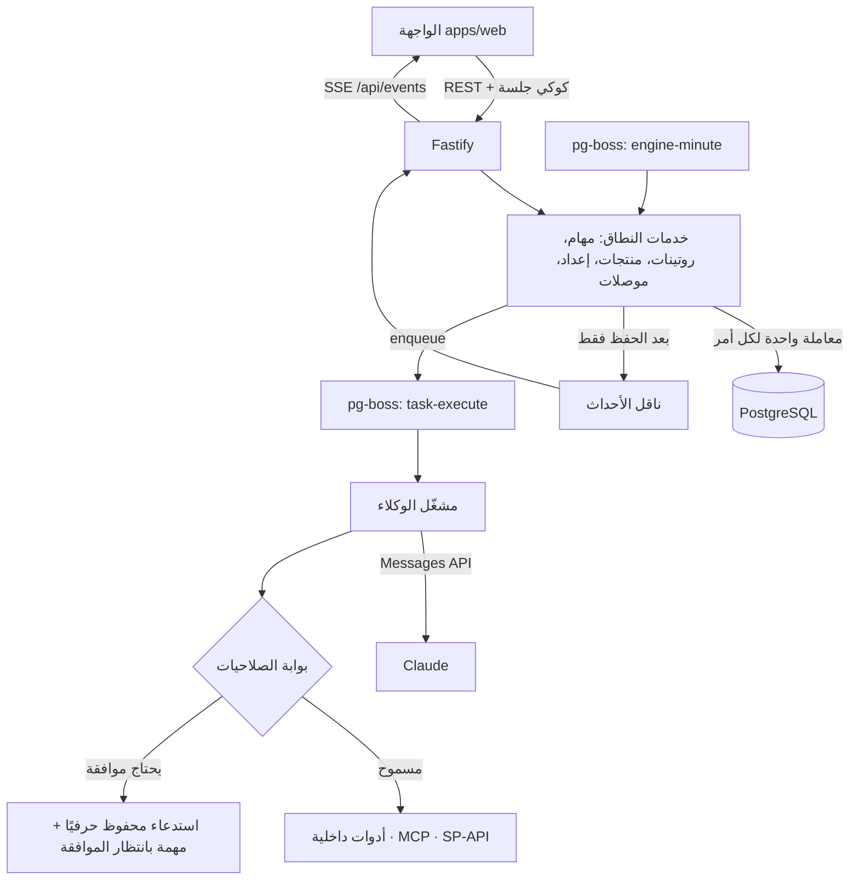

# المعمارية

## الصورة العامة

## القرارات الرئيسية

| القرار | السبب |
|---|---|
| حزمة نطاق مشتركة (`@agents/domain`) | قاعدة واحدة للتوجيه والصلاحيات والجدولة في الخادم والواجهة؛ تُختبر دون قاعدة بيانات |
| المحرك في الخادم فقط | المتصفح لا يقرر شيئًا؛ الواجهة عميل رفيع للعقد (§18)، والقاعدة الذهبية (§3) مضمونة بنيويًا |
| PostgreSQL + pg-boss | الطابور والجدولة في القاعدة نفسها (§20): لا خدمات إضافية، ومعاملات حقيقية، وإعادة محاولة بتأخير متزايد |
| معاملة لكل أمر ثم بث الأحداث | لا يرى المستخدم حالة لم تُحفظ؛ الأحداث تُنشر بعد `commit` فقط |
| فهرس فريد `(routine_id, at)` | إنشاء تشغيلات الروتينات آمن التكرار ومتوازٍ دون تكرار |
| سياسة `stately` في طابور التنفيذ | تشغيل واحد نشط لكل مهمة مهما تكرر الإرسال |
| حلقة أدوات يدوية مع سجل محادثة محفوظ | يمكن إيقاف التشغيل عند فعل يحتاج موافقة واستئنافه بعد القرار، حتى بعد إعادة تشغيل الخادم |
| الخادم عميل MCP (لا `mcp_servers`) | كل استدعاء أداة خارجية يمر بالبوابة وسجل التدقيق؛ النموذج لا يصل لأي خدمة مباشرة |

## دورة المهمة

1. **الإنشاء:** من المالك أو روتين أو تنبيه أو محادثة. «تلقائي» يمر بالمدير التنفيذي (1.5 ثانية) ثم كلمات التوجيه (§10)، ويُختار المتخصص بكلمة من اسمه وإلا الأقل حملًا.
2. **الموافقة على مستوى المهمة:** تُحسب من نوع الفعل وقيمته المستنتجين من العنوان، أو تُفرض بـ«بعد موافقتي».
3. **التنفيذ:** يرسل المشغّل للنموذج دور الوكيل وتعليماته والمهمة والمنتج ومؤشرات اليوم. أدوات القراءة (المؤشرات، المنتجات، المهام، العقل، الحاسبة، أدوات MCP للقراءة) تُنفذ مباشرة.
4. **البوابة:** أدوات الأفعال (سعر، ميزانية، قائمة، مورد، بريد خارجي، أمر شراء، دفعة، وأدوات الكتابة في MCP) تُقيَّم بالسياسة على الخادم مع استثناءات الوكيل والقسم. ما يحتاج موافقة يُحفظ بمدخلاته كما هي، وتصبح المهمة «بانتظار الموافقة» مع مسودة وسبب.
5. **القرار:** الموافقة تنفّذ الاستدعاء المحفوظ حرفيًا ثم يستكمل الوكيل ليكتب النتيجة. الإعادة ترجع للوكيل مع ملاحظة المالك. الرفض يلغي المهمة.
6. **الإنهاء:** `submit_result` بملخص ومستند؛ يُحتسب الاستهلاك من الرموز الفعلية.

الدفع: أداة `prepare_payment` تنتج تعليمات فقط، وسياستها مقفلة على «دائمًا» في الخادم مهما أُرسل من الواجهة.

## الأمان

- **الدخول:** مالك واحد، كلمة مرور قوية مجزأة بـ scrypt، جلسات في القاعدة (يُخزن SHA-256 للرمز فقط)، كوكي `HttpOnly; SameSite=Strict`، انتهاء بعد 30 يومًا، وحد لمحاولات الدخول.
- **CSRF:** كوكي `SameSite=Strict` + رفض أي تعديل ليس `application/json`.
- **رموز الاستقبال:** منفصلة عن جلسة المالك، مجزأة، ولا تصل إلا إلى `/api/ingest/*`.
- **الأسرار:** مفاتيح الموصلات مشفرة AES-256-GCM بمفتاح `MASTER_KEY`، ولا تعود للمتصفح (آخر 4 خانات فقط).
- **حقن التعليمات:** نتائج الأدوات الخارجية تُغلّف في `<external_data>`، وتعليمات النظام تنص على أنها بيانات لا أوامر (§20).
- **التدقيق:** `tool_calls` لكل استدعاء أداة (الوكيل، الأداة، المدخلات، النتيجة، الحالة، من وافق)، و`audit_log` لكل فعل من المالك.
- **الإيقاف:** زر المحرك يلغي التشغيلات الجارية فورًا، ويمنع أي استدعاء جديد للنموذج أو الأدوات حتى الاستئناف.

## الوقت والمال

- المنطقة الزمنية للخادم `Asia/Riyadh` (بلا توقيت صيفي)؛ «اليوم» وأيام العمل (الأحد–الخميس) تُحسب بها. الواجهة تعرض الأوقات بتوقيت جهاز المالك، فيُفترض أن يكون على توقيت الرياض.
- كل المبالغ أعداد صحيحة بالهللة (`bigint`)؛ الأسعار في لوحات الإدخال بالريال وتُحوَّل عند الحفظ.

## قابلية التوسع

- الناقل الحالي داخل العملية؛ لتشغيل أكثر من نسخة يُستبدل بـ `LISTEN/NOTIFY` دون تغيير الخدمات (الطابور والجدولة تعمل أصلًا عبر القاعدة).
- الترحيلات مرقمة وتُطبق تحت قفل استشاري، فيمكن تشغيل عدة نسخ بأمان.
- الموصلات الجديدة: أي خدمة لها خادم MCP تعمل دون شيفرة؛ الواجهات الرسمية تُضاف كوحدة في `apps/server/src/connectors` مع اختبار حقيقي في `services/connectors.ts`.
