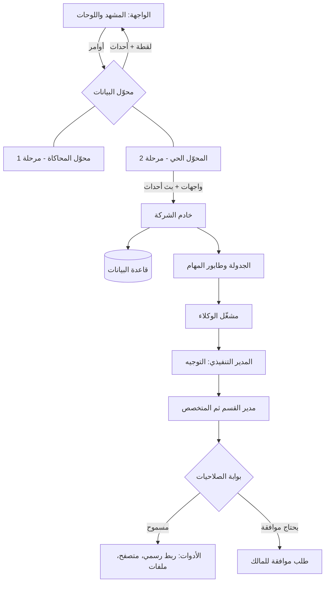
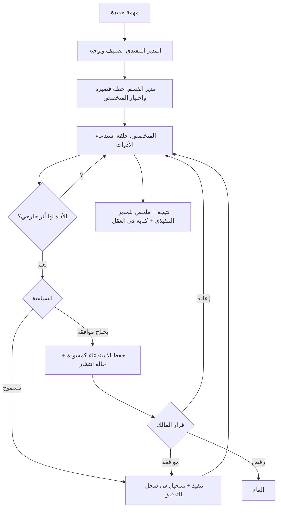

# وثيقة المشروع: شركة الوكلاء لتجارة أمازون

Sep 25, 2026 · @Mohammed Aldossary

## 1. تعليمات المنفّذ والملخص

**لأي نموذج ذكاء اصطناعي أو مطوّر يستلم هذه الوثيقة:** نفّذها حرفيًا. كل رقم ولون وموضع ونص قيمة ملزمة. البيانات المرجعية (القسم 10) تُنسخ كما هي. لا تضف شاشات أو مكتبات غير مذكورة، ولا تحذف شيئًا. عند الغموض اختر الأبسط الذي لا يغيّر الشكل ولا السلوك. كل ما يُعلَّم «مرحلة 2» أو «مرحلة 3» لا يُنفَّذ في المرحلة الأولى، لكن يجب أن تسمح بنية المرحلة الأولى بإضافته دون إعادة تصميم.

**المنتج:** شركة افتراضية من وكلاء ذكاء اصطناعي تدير تجارة على أمازون السعودية، إضافة إلى أعمال صاحبها الشخصية والتطويرية. تُعرض كمبنى ثلاثي الأبعاد متساوي القياس: ثماني جزر للأقسام حول مركز معرفة اسمه العقل. كل مهمة يكتبها المالك تمر عبر المدير التنفيذي إلى القسم المختص، ثم إلى الوكيل المتخصص، ثم الأدوات، ثم تعود النتيجة.

**الأسئلة الثلاثة التي تجيب عنها الشاشة:** كيف حال التجارة الآن؟ ماذا يفعل الوكلاء؟ ماذا يحتاج مني اليوم؟

| البند | القيمة |
| --- | --- |
| اسم المنتج | شركة الوكلاء |
| النشاط | تجارة أمازون السعودية + أعمال شخصية وتطويرية |
| الأقسام | 8 + مركز المعرفة |
| الوكلاء | 32 (8 مديرين + 23 متخصصًا + حارس المعرفة) |
| الأدوات في الشريط العلوي | 10 أساسية، والبقية داخل أقسامها |
| الروتينات الافتراضية | 18 |
| المنتجات التجريبية | 8 |
| العملة | ريال سعودي، ويُكتب «ر.س» |
| أسبوع العمل | الأحد إلى الخميس |
| الجهاز | شاشة مكتبية فقط، بعرض أدنى 1280 بكسل |
| لغة الواجهة | العربية بالكامل، من اليمين لليسار |

**ترتيب التنفيذ الموصى به:** التخطيط والتصميم (4، 5) ← الهيكل التنظيمي والمشهد (6 إلى 8) ← البيانات (9، 10) ← طبقة البيانات (18) قبل أي واجهة تقرأ البيانات ← الميزات (11 إلى 16) ← المحاكاة (17) ← الحفظ (21) ← الاختبار (22). القسمان 19 و20 مرجع للمرحلتين الثانية والثالثة.

## 2. النطاق والمراحل

المشروع يُبنى على ثلاث مراحل. الواجهة لا تتغير بين المراحل؛ الذي يتغير فقط مصدر البيانات خلف عقد موحّد (القسم 18).

| المرحلة | ما يُسلَّم | مصدر البيانات |
| --- | --- | --- |
| 1 — الواجهة والمحاكاة | الواجهة كاملة بكل الميزات في هذه الوثيقة، تعمل في المتصفح وحده | محوّل المحاكاة داخل الصفحة |
| 2 — الخادم والربط الأساسي | خادم، قاعدة بيانات، مشغّل وكلاء حقيقي، جدولة، ربط أدوات جوجل ونوشن وهيليوم 10 وأمازون (البائع والإعلانات) | محوّل حيّ عبر واجهات الخادم وبث الأحداث |
| 3 — بقية الأدوات | منصات التوريد والشحن وسابر والزكاة وكانفا والتحليلات والمصارف وأدوات التطوير | متصفح آلي، واستيراد ملفات، وواجهات رسمية حيث توجد |

**قيود المرحلة الأولى:**

| البند | القيمة الملزمة |
| --- | --- |
| نوع الملف | HTML واحد، CSS وJS مضمّنان، بلا أدوات بناء |
| مكتبة ثلاثي الأبعاد | three.js r128 (UMD) من https://cdnjs.cloudflare.com/ajax/libs/three.js/r128/three.min.js |
| الخطوط | Google Fonts: Amiri 400/700 · IBM Plex Sans Arabic 400/500/600/700 · JetBrains Mono 400/600 |
| لغة الصفحة | lang="ar" dir="rtl" |
| التخزين | localStorage داخل try/catch |
| الشبكة | لا طلبات بعد التحميل في وضع المحاكاة |
| الشيفرة | دالة فورية واحدة مع 'use strict'، ومحوّل البيانات منفصل في كائن مستقل داخل الملف |

**خارج النطاق في كل المراحل:** دعم الجوال، حسابات مستخدمين متعددين، إشعارات خارجية، حساب تكلفة تشغيل الوكلاء، وتنفيذ أي دفع مالي آليًا. الوكلاء يجهّزون المدفوعات ولا ينفذونها أبدًا.

## 3. المعمارية

الواجهة لا تعدّل البيانات مباشرة أبدًا. كل قراءة وكتابة تمر عبر محوّل بيانات واحد له عقد ثابت. في المرحلة الأولى المحوّل محاكاة داخل الصفحة، وفي الثانية محوّل حي يتحدث مع الخادم. الواجهة تستقبل الأحداث من المحوّل وتعيد العرض.



**مسار أي مهمة:** المالك ← المدير التنفيذي (يصنّف ويوجّه) ← مدير القسم ← الوكيل المتخصص ← الأدوات عبر بوابة الصلاحيات ← النتيجة ← المدير التنفيذي (يلخّص) ← المالك.

| الوحدة داخل الصفحة | المسؤولية |
| --- | --- |
| helpers | الوقت والتنسيق والعملة والعشوائية والهروب من الرموز |
| data | الثوابت المرجعية |
| adapter | عقد البيانات وتنفيذه (محاكاة الآن) |
| store | نسخة الواجهة من اللقطة، تُحدَّث من أحداث المحوّل فقط |
| scene / camera / overlay / wires | المشهد ثلاثي الأبعاد وطبقاته |
| panels | الترويسة، شريط النبض، لوحة المهام، لوحة القسم، المنتجات، التقويم، النوافذ |
| render\* | إعادة بناء كل لوحة من المخزن |

**قاعدة ذهبية:** أي زر في الواجهة يستدعي دالة من عقد المحوّل ثم ينتظر الحدث الراجع؛ لا يغيّر المخزن بنفسه. هذا وحده ما يجعل الانتقال للربط الحقيقي تبديل محوّل لا إعادة كتابة.

## 4. هيكل الشاشة

الجذر شبكة من أربعة صفوف: الترويسة، شريط النبض، المنطقة الرئيسية، التذييل. الصفحة لا تتمرر؛ كل لوحة تتمرر داخليًا. العرض الأدنى 1280 بكسل، وتحته يظهر تمرير أفقي للصفحة بدل إعادة الترتيب.

```
#app (grid rows: auto | auto | minmax(0,1fr) | auto ; height:100% ; min-width:1280px)
 ├─ svg#wires            absolute inset:0, z 2, pointer-events:none
 ├─ header#top           z 4 : .brand | .conn(#tools) | .rt(#engine #calbtn #prodbtn #alertbtn #apbtn #policybtn #clock)
 ├─ section#pulse        z 4 : 4 بطاقات أرقام | زر الإيجاز الصباحي
 ├─ main#main
 │   ├─ aside#left       منطقة left (عند التركيز فقط)
 │   ├─ section#stage    منطقة stage : canvas #overlay #back .zoom
 │   ├─ aside#right      منطقة right : .composer .tsh #filters #nextline #tasklist
 │   ├─ div#cal          طبقة التقويم (absolute inset:0, z 6)
 │   └─ div#products     طبقة المنتجات (absolute inset:0, z 6)
 └─ footer
#modal (fixed z 40) · #drop (قائمة منسدلة عائمة z 30) · #toast (fixed z 50)
```

| الحالة | الأعمدة | المناطق |
| --- | --- | --- |
| نظرة عامة | minmax(0,1fr) 400px | "stage right" |
| تركيز على قسم | 340px minmax(0,1fr) 400px | "left stage right" |
| عرض ≤ 1440 (عام) | minmax(0,1fr) 360px | — |
| عرض ≤ 1440 (تركيز) | 300px minmax(0,1fr) 360px | — |

بسبب الاتجاه من اليمين لليسار تظهر لوحة القسم يمينًا ولوحة المهام يسارًا تلقائيًا.

**أزرار الترويسة** (من اليمين لليسار بعد الشعار والأدوات):

| الزر | النص | السلوك |
| --- | --- | --- |
| المحرك | ● يعمل في الخلفية على ✳ | إيقاف أو استئناف كل الوكلاء |
| التقويم | التقويم | يفتح أو يغلق طبقة التقويم |
| المنتجات | المنتجات | يفتح أو يغلق طبقة المنتجات |
| التنبيهات | 🔔 N | قائمة التنبيهات (القسم 12)؛ حد أحمر إن وُجد تنبيه حرج |
| الموافقات | ▲ N | قائمة الموافقات؛ حد برتقالي |
| الصلاحيات | ⚙ | نافذة صلاحيات الوكلاء |
| الساعة | hh:mm:ss ص/م | تتحدث كل ثانية |

طبقتا التقويم والمنتجات لا تُفتحان معًا؛ فتح إحداهما يغلق الأخرى. مفتاح الهروب يغلق الطبقة المفتوحة، ثم يعود للنظرة العامة إن لم تكن طبقة مفتوحة.

## 5. نظام التصميم

الطابع: داكن دائمًا، بطاقات زجاجية شبه شفافة، خط مزخرف للعناوين، توهج نيون بلون القسم للتحديد والحالة فقط. تباعد الحروف صفر على كل العناصر حفاظًا على اتصال الحروف العربية.

```css
:root{
  --bg:#16183D; --card:rgba(31,34,80,.88); --card-solid:#1f2250;
  --line:rgba(255,255,255,.13); --line2:rgba(255,255,255,.26);
  --ink:#EEF0FF; --ink2:#B4B8E4; --ink3:#7C81B3;
  --wait:#F2A541; --ok:#4CD08A; --alert:#FF4D5E; --sky:#8FD3FF;
  --up:#4CD08A; --down:#FF6B7A;
  --serif:'Amiri','Times New Roman',serif;
  --sans:'IBM Plex Sans Arabic',system-ui,-apple-system,'Segoe UI',sans-serif;
  --mono:'JetBrains Mono','IBM Plex Sans Arabic',ui-monospace,Menlo,monospace;
}
#app{background:radial-gradient(120% 90% at 42% 42%,#232761 0%,#191c47 48%,#111335 100%)}
#left,#right{background:linear-gradient(180deg,rgba(24,27,68,.96),rgba(20,22,58,.96))}
body *{letter-spacing:0!important}
```

| الاستخدام | الخط | الحجم |
| --- | --- | --- |
| اسم المنتج | serif 700 | 27px |
| عناوين اللوحات والطبقات | serif 700 | 23px |
| اسم مدير القسم | serif 700 | 26px |
| أرقام شريط النبض | mono 600 | 24px |
| الأرقام في البطاقات | mono 600 | 30px (الكبير) و13–17px (المقاييس) |
| النصوص والأزرار | sans 500–700 | 10–13px |
| بث العمل والملفات والمسودات | mono | 10–12px |

| المكون | المواصفة |
| --- | --- |
| زر كبسولي | حد 1px بلون line2، نصف قطر 999px، حشو 6×14، وزن 700 |
| زر أساسي | خلفية #eef0ff، نص #1d2052 |
| زر موافقة | خلفية wait، نص #1a1300 |
| زر خطر | حد ونص alert |
| بطاقة مهمة أو منتج | حد line، نصف قطر 16px، خلفية بيضاء بشفافية 2.5% |
| نافذة | card-solid، نصف قطر 18px، عرض أقصى 620px، طبقة خلفية rgba(8,9,28,.6) |
| قائمة منسدلة | عرض 340px، ارتفاع أقصى 60% من الشاشة، card-solid |
| إشعار عائم | أسفل الوسط، كبسولي فاتح، يختفي بعد 2200 مللي ثانية |
| شارة مستوى التنبيه | حرج: alert · تحذير: wait · معلومة: sky |
| تركيز لوحة المفاتيح | إطار 2px بلون sky بإزاحة 2px |

**تنسيق العملة والأرقام:** أرقام غربية بفاصل آلاف، ثم «ر.س». المبالغ فوق مليون تُختصر «1.2 مليون ر.س». النسب بخانة عشرية واحدة. التغير اليومي بسهم ▲ أخضر أو ▼ أحمر ونسبته.

## 6. الهيكل التنظيمي

ثمانية أقسام، لكل قسم مدير (القائد، أول وكيل في قائمته) ومتخصصون يُستدعون حسب المهمة. في المركز وكيل واحد مستقل: حارس المعرفة، مسؤول عن العقل. هذا الهيكل بعد دمج الأدوار المتكررة المعتمد.

| القسم | المدير | المتخصصون ومسؤولياتهم |
| --- | --- | --- |
| الإدارة التنفيذية | المدير التنفيذي ★ | المساعد التنفيذي: المواعيد والمتابعة والطلبات · التخطيط والمشاريع: أهداف ومشاريع العمل وأولوياتها |
| البحث عن المنتجات | مدير البحث ★ | باحث المنتجات: الفرص والبيانات · السوق والمنافسين: الطلب والأسعار والمنافسة · تطوير المنتج: التحسينات والاختلاف |
| أمازون | مدير أعمال أمازون ★ | عمليات أمازون: الطلبات والحساب والحالات · التسعير والربحية: سعر وهامش كل منتج · القوائم والكلمات المفتاحية: نص القائمة وتحسين الظهور · المبيعات والتوقعات: توقع الطلب |
| التوريد والاستيراد | مدير سلسلة الإمداد ★ | التوريد والتفاوض: الموردون والعينات والشروط · الاستيراد والتكلفة الواصلة: الشحن والتخليص وحساب التكلفة الكاملة · تخطيط المخزون: كميات ومواعيد إعادة الطلب |
| التسويق والإعلانات | مدير التسويق ★ | الإعلانات: حملات أمازون المدفوعة · الاستراتيجية والعروض: الخصومات والمواسم · المحتوى المرئي: الصور والفيديو والمحتوى المتقدم |
| المالية | المدير المالي ★ | مالية الأعمال: الربحية والتدفق النقدي · المالية الشخصية: الميزانية والالتزامات الشخصية |
| التقنية والذكاء الاصطناعي | مدير التقنية ★ | بناء الوكلاء · الأتمتة وسير العمل · الأنظمة والبيانات · الجودة والاختبار |
| الإدارة الشخصية | مدير الإدارة الشخصية ★ | التخطيط والإنتاجية: الأهداف واليوم والأولويات · التعلم والتطوير |
| المركز | — | حارس المعرفة: حفظ المعرفة وتنظيمها وربطها في العقل |

**حدود بين الأدوار المتقاربة** (تُستخدم في التوجيه، القسم 14):

| الموضوع | المسؤول | ليس مسؤولًا |
| --- | --- | --- |
| سعر البيع وهامش المنتج | التسعير والربحية | المالية |
| التكلفة الواصلة للمنتج | الاستيراد والتكلفة الواصلة | المالية |
| التدفق النقدي وربح الشركة | مالية الأعمال | أمازون |
| توقع المبيعات | المبيعات والتوقعات | تخطيط المخزون |
| كمية وموعد إعادة الطلب | تخطيط المخزون | أمازون |
| نص القائمة والكلمات المفتاحية | القوائم والكلمات المفتاحية | التسويق |
| الصور والفيديو | المحتوى المرئي | أمازون |
| مشاريع العمل | التخطيط والمشاريع | الإدارة الشخصية |
| يومي وأهدافي الشخصية | التخطيط والإنتاجية | الإدارة التنفيذية |

**مقاييس البطاقات** (مقياسان لكل قسم):

| القسم | المقياس الأول | المقياس الثاني |
| --- | --- | --- |
| الإدارة التنفيذية | مهام اليوم | قرارات بانتظارك |
| البحث عن المنتجات | منتجات قيد الدراسة | فرص مؤهلة |
| أمازون | طلبات اليوم | مخزون منخفض |
| التوريد والاستيراد | موردون قيد التفاوض | شحنات في الطريق |
| التسويق والإعلانات | حملات نشطة | نسبة الإعلان للمبيعات % |
| المالية | هامش صافي الشهر % | مصروفات الشهر |
| التقنية والذكاء الاصطناعي | وكلاء يعملون | اختبارات فاشلة |
| الإدارة الشخصية | أهداف الأسبوع | مهامي اليوم |

## 7. المشهد ثلاثي الأبعاد

ثماني منصات على شبكة 3×3 بمسافة 11 بين المراكز، والعقل في الخلية الوسطى. الإدارة التنفيذية في الخلية الأمامية الأقرب للمشاهد، لأنها المدخل. كل المواد معيارية بخشونة 0.85 ومعدنية صفر، إلا الشاشات والحلقة واللب فهي مواد أساسية مضيئة.

```js
renderer = new THREE.WebGLRenderer({antialias:true, alpha:true});
renderer.setPixelRatio(Math.min(devicePixelRatio,2));
renderer.shadowMap.enabled = true; renderer.shadowMap.type = THREE.PCFSoftShadowMap;
cam = new THREE.OrthographicCamera(-1,1,1,-1,-300,400);  OFF=(30,30,30); VIEW=44;
HemisphereLight(0xc4ccff, 0x1a1c40, .72)
DirectionalLight(0xffffff,.62) pos(-14,36,12) target(0,0,0) castShadow
  shadow.mapSize 2048² ; camera ±32 ; near 1 ; far 100 ; bias -.0006
DirectionalLight(0x9fb2ff,.25) pos(20,10,-10)
```

| القسم | المعرّف | الموضع (x, z) | السطح | الجوانب | اللون المميز |
| --- | --- | --- | --- | --- | --- |
| الإدارة التنفيذية | exec | (11, 11) | 0x8a7440 | 0x5c4d2a | #FFD27A |
| التسويق والإعلانات | marketing | (0, 11) | 0x7a4f7a | 0x503350 | #FF8AD0 |
| أمازون | amazon | (11, 0) | 0xa0683a | 0x6b4526 | #FFB066 |
| الإدارة الشخصية | personal | (-11, 11) | 0x8a5a52 | 0x5a3934 | #FFB08A |
| المالية | finance | (11, -11) | 0x3f7a52 | 0x28503a | #7FE0A0 |
| البحث عن المنتجات | research | (-11, 0) | 0x2b7372 | 0x1a4a4a | #5FE0C8 |
| التوريد والاستيراد | supply | (0, -11) | 0x3e62a8 | 0x273f70 | #8FD3FF |
| التقنية والذكاء الاصطناعي | tech | (-11, -11) | 0x5b4f86 | 0x3a3358 | #C3A6FF |

**المنصة:** مربع مستدير 7.2×7.2 بنصف قطر 0.55، مبثوق بعمق 1، شطف 0.08 بمقطعين، منحنيات بعشرة مقاطع؛ يُدار ربع دورة سالبة حول المحور الأفقي ثم يُزاح للأسفل 1، فيكون سطحه عند 0.08. مادتان: السطح والجوانب. تستقبل الظلال وتلقيها.

**المركز:** أسطوانة نصف قطرها 3 وارتفاعها 0.5 بلون 0x262a5e مركزها عند -0.25؛ حلقة نصف قطرها 3 وسماكتها 0.05 بلون 0x8fd3ff مسطحة عند 0.02 تتذبذب شفافيتها بين 0.30 و0.80؛ حواف مجسم عشريني نصف قطره 0.9 بتقسيم 1 بلون 0xaec0ff وشفافية 0.75 عند ارتفاع 1.9 يدور ببطء؛ كرة مضيئة 0.35 داخله. مكتب حارس المعرفة على المركز عند (1.4, 1.4) بنفس بناء المكاتب.

**الجسور:** من المركز لكل منصة: صندوق طوله المسافة، ارتفاعه 0.22، عرضه 1.7، بلون 0x2b2f58، في المنتصف عند -0.13، مُدار بسالب ظل الزاوية.

**المكتب الواحد** (مجموعة مُدارة 45°؛ الوكيل بظهره للكاميرا والشاشة تواجهها):

| الجزء | الشكل والقياس | الموضع المحلي | اللون |
| --- | --- | --- | --- |
| سطح المكتب | صندوق 1.55×0.08×0.9 | (0, 0.78, 0) | 0xe3d6bf |
| الأرجل ×4 | أسطوانة 0.035×0.78 | (±0.68, 0.39, ±0.36) | 0x2b2b36 |
| قاعدة الشاشة | صندوق 0.4×0.03×0.2 | (0, 0.835, -0.25) | 0x23242e |
| الحامل | صندوق 0.07×0.36×0.06 | (0, 1.0, -0.27) | 0x23242e |
| إطار الشاشة | صندوق 1.2×0.76×0.06 | (0, 1.42, -0.24) | 0x23242e |
| سطح العرض | مستوٍ 1.1×0.66 بخامة لوحة رسم 160×100 | (0, 1.42, -0.205) | خامة حية |
| مقعد الكرسي | أسطوانة 0.3×0.07 | (0, 0.47, 0.66) | 0x2e3044 |
| عمود الكرسي | أسطوانة 0.04×0.42 | (0, 0.24, 0.66) | 0x2b2b36 |
| ظهر الكرسي | صندوق 0.56×0.34×0.07 | (0, 0.72, 0.95) | 0x2e3044 |
| الجذع | أسطوانة 0.19→0.25×0.52 | (0, 0.78, 0.62) | 0x4a4f6a؛ المدير: اللون المميز × 0.55 |
| الرأس | كرة 0.2 | (0, 1.2, 0.6) | 0x3a2c28 |

| عدد الوكلاء | الإزاحات (x, z) بالترتيب، الأول المدير | موضع المجسم المميز |
| --- | --- | --- |
| 3 | (-1.8,-1.8) (1.8,-1.8) (-1.8,1.8) | (1.9, 1.9) |
| 4 | (-1.8,-1.8) (1.8,-1.8) (-1.8,1.8) (1.8,1.8) | (0, 0) |
| 5 | (-2.1,-2.1) (2.1,-2.1) (0,0) (-2.1,2.1) (2.1,2.1) | (3.1, 0) |

**مجسم مميز لكل قسم** (مجسمات بسيطة، تلقي ظلًا):

| القسم | المجسم |
| --- | --- |
| الإدارة التنفيذية | طاولة اجتماعات: صندوق 1.8×0.08×1 على ارتفاع 0.6 بلون 0x6b5a3a مع 4 أرجل |
| التسويق | نبتة (أصيص 0.28→0.22×0.4 بلون 0xcfc3b0 وأوراق عشرينية 0.45 و0.32 بلون 0x3f8f5a) |
| أمازون | ثلاثة صناديق شحن 0.5 مكعبة بلون 0xc9a27a متراصة 2+1 |
| الإدارة الشخصية | نبتة بمقياس 0.9 |
| المالية | ثلاث أكوام عملات: أسطوانات 0.22 بارتفاعات 0.3 و0.45 و0.2 بلون 0xe0b84a |
| البحث | نبتة بمقياس 0.8 |
| التوريد | أربعة صناديق شحن 0.55 مكعبة 2+2 ولوح نقل خشبي 1.2×0.1×1.2 بلون 0x9b7b55 |
| التقنية | خزانة خوادم: صندوق 0.7×1.6×0.6 بلون 0x23242e وثلاثة شرائط مضيئة 0.5×0.04 باللون المميز |

**شاشات الوكلاء** (خلفية #f5f7fc مشغول و#aeb2c8 خامل، شريط علوي 10px باللون المميز، عمود جانبي بخمسة أسطر، والمحتوى يتحرك بإزاحة زمنية):

| القسم | نمط الشاشة |
| --- | --- |
| الإدارة التنفيذية | شبكة تقويم صغيرة مع قائمة |
| البحث | أعمدة بيانية ترتفع وتنخفض |
| أمازون | صفوف طلبات بمربع صورة ورقم |
| التوريد | خريطة نقاط مع خط مسار متقطع يتحرك |
| التسويق | منحنى خطي يرتسم |
| المالية | جدول أرقام مع دائرة نسب |
| التقنية | أسطر شيفرة ملونة تتمرر |
| الإدارة الشخصية | قائمة تحقق تتعلّم عناصرها تباعًا |
| حارس المعرفة | عقد مترابطة بخطوط |

تُرسم الشاشات كل 350 مللي ثانية: كل شاشات القسم المفتوح، أو ست شاشات عشوائية في النظرة العامة. الوكيل المشغول يهتز رأسه بسعة 0.018 ويميل جذعه بسعة 0.04.

## 8. الكاميرا والتراكب والأسلاك

**الكاميرا:** كل إطار تقترب قيم الهدف والتكبير من المستهدف بمعامل 0.12 (أو 1 مع تقليل الحركة)، ثم توضع عند الهدف مضافًا إليه الإزاحة وتنظر إليه.

```js
a = stageW/stageH; cam.left=-VIEW*a/2; cam.right=VIEW*a/2; cam.top=VIEW/2; cam.bottom=-VIEW/2;
// computeFit
cam.zoom=1; placeCam((0,0,0));
pts = لكل قسم: (x±3.8, 0, z±3.8) + (cardAnchor + (0,7,0))
fitZoom = min(1.9/(x1-x0), 1.9/(y1-y0));
overviewTarget = (0,0,0) + camRight*(cx*cam.right) + camUp*(cy*cam.top);
// السحب
ppu = stageH/(VIEW/cam.zoom); R=normalize(1,0,-1); U=normalize(-1,0,-1);
camGoal += R*(-dx/ppu) + U*(dy/(ppu*.577));
```

| الفعل | السلوك |
| --- | --- |
| التحميل وتغيير الحجم | مراقب حجم يعيد الحساب؛ النظرة العامة = الملاءمة، والتركيز = ملاءمة × 2.2 |
| التمرير فوق منصة | تقاطع شعاع؛ تضيء بطاقة القسم والمؤشر يد |
| النقر على منصة أو بطاقة | التركيز: الهدف (x, 0.8, z)، ويفتح لوحة القسم، ويُضبط منشئ المهام على القسم |
| النقر على المركز | يفتح نافذة العقل: عدد الملاحظات، آخر 15 قراءة وكتابة، وحارس المعرفة |
| السحب | أكثر من 4 بكسل = سحب لا نقر |
| العجلة | × e^(-dy × 0.0012) |
| أزرار + / − / ⌂ | × 1.25 / ÷ 1.25 / النظرة العامة |
| حدود التكبير | ملاءمة × 0.6 إلى ملاءمة × 5 |

**بطاقة القسم:** مرساها (x-1.6, 3.2, z-1.6)، عرض 212px، حشو 10×14، نصف قطر 16px، ضبابية 6px. المحتوى: نقطة اللون والاسم ونقطة تنبيه حمراء (عند تنبيه حرج للقسم أو مهمة متأخرة 45 دقيقة)؛ عدد الوكلاء كبيرًا مع «وكلاء»؛ المقياسان؛ سطر «يعمل / التالي / منجز»؛ شريط برتقالي «بانتظار الموافقة» عند وجود موافقة. تختفي البطاقات عند التركيز.

```js
cs = clamp(stageW/1400,.5,.9) * clamp(zoom/fitZoom,.8,1.25);
card.style.transform = `translate(${x}px,${y}px) scale(${cs}) translate(-50%,-100%)`;
tagScale = clamp(zoom/fitZoom*.6,.8,1.12);
```

**لافتة الوكيل:** مرساها المحلي (0, 2.05, -0.24). كبسولة داكنة 9px: نجمة برتقالية للمدير، الاسم، نقطة خضراء إن كان مشغولًا وعدد مهامه. تظهر للقسم المفتوح عند التركيز، وفي النظرة العامة فقط إن كان التكبير أكبر من ملاءمة × 1.35. لا يُعاد بناؤها إلا عند تغيّر محتواها.

**لافتة العقل:** مرساها (0, 1.1, 0): «العقل \[العدد\] ملاحظة» بحد سماوي، وتحتها «\[الوكيل\] قرأ \[الملاحظة\]» أو «\[الوكيل\] كتب \[الملاحظة\]» يتلاشى 250 مللي ثانية عند التحديث. تختفي عند التركيز.

**الأسلاك** (عنصر رسم متجه يغطي الجذر):

| النوع | المسار | المظهر |
| --- | --- | --- |
| أداة ← قسم | تكعيبي: تحكم (x1, y1+90) و(x2, y2-160) من منتصف أسفل الأيقونة إلى (x, 0.2, z) | أبيض بشفافية 0.26، سماكة 1، تقطيع 2 6 |
| العقل ← قسم | تربيعي، التحكم في المنتصف مرفوع 30 | سماوي بشفافية 0.28، تقطيع 1 5 |
| التنفيذي ← قسم (مؤقت) | تربيعي بين المنصتين، التحكم مرفوع 60، يظهر 1800 مللي ثانية ثم يختفي | ذهبي #FFD27A بشفافية 0.6، تقطيع 3 5 |
| الحركة | إزاحة التقطيع 0 إلى -16 خلال 1.6 ثانية | تتوقف مع تقليل الحركة |

أسلاك الأدوات تُرسم فقط للأدوات العشر الظاهرة في الترويسة. عند التركيز يُظهر الشريط أدوات القسم كلها (حتى غير الأساسية) ويرسم أسلاكها له وحده، وتُخفى أسلاك العقل. تُخفى كل الأسلاك عند فتح التقويم أو المنتجات.

**النبضات:** دائرة بيضاء نصف قطرها 2.6 تسري 1300 مللي ثانية ثم تُحذف: من الأداة للقسم عند استخدامها، وعلى سلك العقل عند القراءة أو الكتابة، وعلى السلك الذهبي عند توجيه المدير التنفيذي مهمة لقسم (نبضة ذهبية).

## 9. نموذج البيانات

النموذج نفسه يُستخدم في المحاكاة وفي قاعدة البيانات لاحقًا؛ لذلك المعرّفات نصية والأوقات بالمللي ثانية والمبالغ بالهللة (عدد صحيح) لتجنب أخطاء الكسور.

```ts
type DeptId = 'exec'|'research'|'amazon'|'supply'|'marketing'|'finance'|'tech'|'personal'|'core';
type Status = 'scheduled'|'progress'|'waiting'|'done'|'backlog'|'cancelled';
type ActionType = 'read'|'report'|'internal'|'price_change'|'ad_budget'|'listing_edit'
                |'supplier_msg'|'purchase_order'|'payment'|'external_email';
type Stage = 'research'|'sourcing'|'shipping'|'live'|'paused';

interface Task {
  id:string; title:string; dept:DeptId; agent:string; status:Status;
  at:number|null; doneAt:number|null; progress:number;       // 0..100
  action:ActionType; value?:number;       // قيمة الفعل: نسبة تغيير السعر أو المبلغ بالهللة
  ok:boolean;                             // تُحسب من سياسة الصلاحيات عند الإنشاء
  routine:string|null; source:string|null; productId:string|null;
  model:'SONNET'|'OPUS'|'HAIKU'; team:boolean; viaExec:boolean;
  artifact:{name:string, body:string}|null;   // مسودة بانتظار الموافقة
  result:{summary:string, file?:{name:string, body:string}}|null;  // نتيجة المنجزة
}
interface Routine { id:string; title:string; dept:DeptId; agent:string;
  freq:'daily'|'workdays'|'weekly'|'monthly1'; dow?:number; time:'HH:MM';
  action:ActionType; paused:boolean; }
interface Product { id:string; name:string; sku:string; asin:string|null; stage:Stage;
  stageSince:number; cost:number; price:number; stock:number; sales7d:number;
  note:string; }
interface Alert { id:string; level:'critical'|'warning'|'info'; dept:DeptId; agent:string;
  title:string; detail:string; productId:string|null; at:number; dismissed:boolean;
  taskId:string|null; }       // المهمة المنشأة منه إن وُجدت
interface Policy { action:ActionType; label:string; mode:'auto'|'limit'|'always';
  limit?:number; unit?:'%'|'SAR'; }
interface Kpi { salesToday:number; salesYesterday:number; profitToday:number;
  profitYesterday:number; adSpendToday:number; cash:number; ordersToday:number; }
interface Brief { id:string; at:number; text:string; read:boolean; }
interface Event { t:number; dept:DeptId; agent:string; kind:'start'|'finish'|'draft'|'route'
  |'read'|'write'|'alert'|'approve'|'cancel'|'stage'; text:string; }
interface State { v:4; seq:number; notes:number; tasks:Task[]; routines:Routine[];
  products:Product[]; alerts:Alert[]; policies:Policy[]; kpi:Kpi;
  metrics:Record<DeptId,[number,number]>; chats:Record<DeptId,{me:boolean,text:string}[]>;
  briefs:Brief[]; running:boolean; lastBriefDay:number; }
```

**حساب حاجة المهمة للموافقة** (عند إنشائها، ومن السياسة المطابقة لنوع فعلها):

| وضع السياسة | النتيجة |
| --- | --- |
| تلقائي | لا تحتاج موافقة |
| حد | تحتاج موافقة إذا تجاوزت القيمة الحد (القيمة المطلقة للنسبة، أو المبلغ) |
| دائمًا | تحتاج موافقة دائمًا |

المستخدم يستطيع دائمًا فرض الموافقة بطريقة «بعد موافقتي» في منشئ المهام، لكنه لا يستطيع إسقاط موافقة تفرضها السياسة إلا بتعديل السياسة نفسها.

**إحصاءات القسم:** يعمل = قيد التنفيذ · التالي = مجدولة قبل نهاية اليوم · منجز = منجزة اليوم · موافقات = بانتظار الموافقة · متأخرة = مجدولة تجاوز موعدها 45 دقيقة. العدادات تستثني الملغاة.

**أيام العمل:** الأحد إلى الخميس (0 إلى 4). التكرار «أيام العمل» يعمل فيها فقط، و«شهري» يعمل في اليوم الأول من الشهر.

## 10. البيانات المرجعية

تُنسخ حرفيًا. أول وكيل في كل قسم هو المدير. المبالغ بالهللة.

**الأقسام والوكلاء والأدوات والمقاييس الابتدائية:**

```js
const DEPTS=[
 {id:'exec',name:'الإدارة التنفيذية',agents:['المدير التنفيذي','المساعد التنفيذي','التخطيط والمشاريع'],
  tools:['gcal','gdrive','gsheets','gmail','notion','gtasks'],metrics:[['مهام اليوم',14],['قرارات بانتظارك','=approvals']]},
 {id:'research',name:'البحث عن المنتجات',agents:['مدير البحث','باحث المنتجات','السوق والمنافسين','تطوير المنتج'],
  tools:['helium10','amazonsa','sellersprite','keepa','trends','gsheets','websearch','files'],metrics:[['منتجات قيد الدراسة',6],['فرص مؤهلة',2]]},
 {id:'amazon',name:'أمازون',agents:['مدير أعمال أمازون','عمليات أمازون','التسعير والربحية','القوائم والكلمات المفتاحية','المبيعات والتوقعات'],
  tools:['sellercentral','amazonsa','helium10','keepa','gsheets','amazonads','gdrive'],metrics:[['طلبات اليوم','=kpi.ordersToday'],['مخزون منخفض','=lowStock']]},
 {id:'supply',name:'التوريد والاستيراد',agents:['مدير سلسلة الإمداد','التوريد والتفاوض','الاستيراد والتكلفة الواصلة','تخطيط المخزون'],
  tools:['alibaba','s1688','mic','gsources','websearch','gsheets','forwarders','calc','saber','zatca'],metrics:[['موردون قيد التفاوض',4],['شحنات في الطريق','=stage.shipping']]},
 {id:'marketing',name:'التسويق والإعلانات',agents:['مدير التسويق','الإعلانات','الاستراتيجية والعروض','المحتوى المرئي'],
  tools:['amazonads','helium10','canva','ga4','trends','gsheets','aimedia'],metrics:[['حملات نشطة',9],['نسبة الإعلان للمبيعات %','=acos']]},
 {id:'finance',name:'المالية',agents:['المدير المالي','مالية الأعمال','المالية الشخصية'],
  tools:['gsheets','gdrive','calc','sellercentral','bank'],metrics:[['هامش صافي الشهر %',18.5],['مصروفات الشهر',2865000]]},
 {id:'tech',name:'التقنية والذكاء الاصطناعي',agents:['مدير التقنية','بناء الوكلاء','الأتمتة وسير العمل','الأنظمة والبيانات','الجودة والاختبار'],
  tools:['replit','base44','github','vercel','figma','postgres','gdrive','browser'],metrics:[['وكلاء يعملون','=busyAgents'],['اختبارات فاشلة',1]]},
 {id:'personal',name:'الإدارة الشخصية',agents:['مدير الإدارة الشخصية','التخطيط والإنتاجية','التعلم والتطوير'],
  tools:['gcal','gtasks','gdrive','gsheets','files','notion'],metrics:[['أهداف الأسبوع',5],['مهامي اليوم',7]]},
 {id:'core',name:'المركز',agents:['حارس المعرفة'],tools:['notion','gdrive'],metrics:null}
];
// المقاييس التي تبدأ بعلامة = تُحسب حيًا:
// approvals = عدد المهام بانتظار الموافقة · lowStock = منتجات نشطة مخزونها يكفي أقل من 20 يومًا
// stage.shipping = منتجات في مرحلة الشحن · acos = إنفاق الإعلان اليوم ÷ مبيعات اليوم × 100
// busyAgents = عدد الوكلاء الذين لديهم مهمة قيد التنفيذ
// أيام المخزون = المخزون ÷ (مبيعات 7 أيام ÷ 7)
```

**كتالوج الأدوات** (الأساسية العشر تظهر في الترويسة بهذا الترتيب، والبقية داخل أقسامها فقط):

| المعرّف | الاسم المعروض | أساسية | الرمز |
| --- | --- | --- | --- |
| gmail | البريد | نعم | ظرف، أحمر على أبيض |
| gcal | التقويم | نعم | صفحة تقويم، أزرق |
| gdrive | المستندات السحابية | نعم | مثلث مسطح، أخضر |
| gsheets | الجداول | نعم | شبكة، أخضر |
| notion | قاعدة المعرفة | نعم | كتاب مفتوح، أسود على أبيض |
| helium10 | هيليوم 10 | نعم | نص «هـ10»، أزرق داكن |
| sellercentral | مركز البائع | نعم | متجر، برتقالي |
| amazonads | إعلانات أمازون | نعم | مكبر صوت، برتقالي |
| alibaba | علي بابا | نعم | نص «ع»، برتقالي |
| websearch | البحث في الويب | نعم | عدسة، سماوي |
| gtasks | مهام جوجل | لا | علامة صح، أزرق |
| amazonsa | متجر أمازون السعودية | لا | عربة، برتقالي |
| keepa | كيبا | لا | منحنى سعر، أخضر |
| sellersprite | سيلر سبرايت | لا | نص «س»، أزرق |
| trends | اتجاهات جوجل | لا | سهم صاعد، أزرق |
| s1688 | 1688 | لا | نص «1688»، برتقالي |
| mic | صنع في الصين | لا | نص «ص»، أحمر |
| gsources | المصادر العالمية | لا | كرة أرضية، أزرق |
| forwarders | شركات الشحن | لا | سفينة، كحلي |
| saber | سابر | لا | ختم، أخضر |
| zatca | هيئة الزكاة | لا | إيصال، أخضر داكن |
| canva | كانفا | لا | فرشاة، بنفسجي |
| ga4 | تحليلات الموقع | لا | أعمدة، برتقالي |
| aimedia | توليد الصور والفيديو | لا | نجمة، وردي |
| bank | كشوف البنوك | لا | مبنى أعمدة، رمادي |
| replit | ريبلت | لا | نص «ر»، برتقالي |
| base44 | بيس 44 | لا | نص «44»، أسود |
| github | جيت هب | لا | فرع، أسود |
| vercel | فيرسل | لا | مثلث، أسود |
| figma | فيجما | لا | دوائر، متعدد |
| postgres | قاعدة البيانات | لا | أسطوانة، أزرق |
| browser | المتصفح الآلي | لا | نافذة، رمادي |
| files | ملفاتك المرفوعة | لا | مجلد، أصفر |
| calc | الحاسبة | لا | آلة حاسبة، رمادي |

الأيقونة 30×24 بنصف قطر 8px، ورموز خطية بسيطة مرسومة يدويًا، دون شعارات تجارية حقيقية. النقر يعرض إشعارًا بالأقسام المستخدمة لها وحالة ربطها (القسم 18).

**عناوين المهام** (العنوان | نوع الفعل | القيمة إن وجدت):

```js
const TITLES={
 exec:[['تجهيز الإيجاز الصباحي','report'],['ترتيب اجتماع مع وكيل الشحن','internal'],['متابعة القرارات المعلّقة','internal'],
  ['تحديث خطة الربع الرابع','internal'],['الرد على بريد مورد الأقمشة','external_email'],['جدولة مراجعة المنتجات الأسبوعية','internal']],
 research:[['تحليل 40 فرصة من هيليوم 10','read'],['دراسة منافسي منظم الأدراج','read'],['حساب حجم الطلب لحامل الجوال','report'],
  ['اقتراح تحسين لتصميم الغطاء','internal'],['فلترة منتجات موسم العودة للمدارس','read'],['تحديث ملف الفرص المؤهلة','internal']],
 amazon:[['تحديث سعر منظم الأدراج','price_change',4],['معالجة حالة مرتجع لطلب متأخر','internal'],['تحسين الكلمات المفتاحية لقائمة الحقيبة','listing_edit'],
  ['توقع مبيعات الشهر القادم','report'],['مراجعة صندوق الشراء لكل المنتجات','read'],['تعديل عنوان قائمة حامل الجوال','listing_edit'],
  ['خفض سعر الفرشاة لمواجهة منافس','price_change',-7]],
 supply:[['طلب عينات من ثلاثة مصانع','supplier_msg'],['التفاوض على سعر 1000 قطعة','supplier_msg'],['حساب التكلفة الواصلة للشحنة البحرية','report'],
  ['متابعة تخليص الشحنة في الميناء','internal'],['اقتراح كمية إعادة الطلب لمنظم الأدراج','report'],
  ['إصدار أمر شراء للدفعة الثانية','purchase_order',1850000],['تجديد شهادة سابر لحامل الجوال','internal']],
 marketing:[['رفع ميزانية حملة منظم الأدراج','ad_budget',15],['إضافة كلمات سلبية للحملة التلقائية','internal'],
  ['تصميم صور المحتوى المتقدم للحقيبة','internal'],['خطة عروض اليوم الوطني','internal'],['تقرير أداء الإعلانات الأسبوعي','report'],
  ['إنتاج فيديو قصير لحامل الجوال','internal']],
 finance:[['تحديث التدفق النقدي الأسبوعي','report'],['مطابقة تسوية أمازون الأخيرة','read'],['تجهيز أرقام إقرار ضريبة القيمة المضافة','report'],
  ['تجهيز تحويل دفعة المورد الثانية','payment',1850000],['مراجعة الميزانية الشخصية للشهر','report'],['تذكير بالالتزام الشهري','internal']],
 tech:[['اختبار وكيل التسعير على بيانات أمس','internal'],['أتمتة تقرير المبيعات اليومي','internal'],['ربط جدول المخزون بقاعدة البيانات','internal'],
  ['إصلاح خطأ في سير عمل التنبيهات','internal'],['مراجعة سجلات تشغيل الوكلاء','read'],['تحديث تعليمات وكيل القوائم','internal']],
 personal:[['ترتيب أولويات الغد','internal'],['مراجعة أهداف الأسبوع','report'],['جلسة تعلم: إعلانات أمازون المتقدمة','internal'],
  ['تلخيص كتاب إدارة المخزون','report'],['حجز موعد الفحص الدوري للسيارة','internal'],['تحديث خطة التعلم الشهرية','internal']],
 core:[['تنظيم ملاحظات الموردين','internal'],['ربط ملاحظات المنتجات بمهامها','internal'],['أرشفة نتائج الأسبوع','internal']]
};
```

**الروتينات الافتراضية (18):**

| المعرّف | الروتين | القسم | الوكيل | التكرار | الوقت | الفعل |
| --- | --- | --- | --- | --- | --- | --- |
| r1 | تجهيز الإيجاز الصباحي | exec | المدير التنفيذي | daily | 08:00 | report |
| r2 | تقرير المبيعات اليومي | amazon | المبيعات والتوقعات | daily | 09:00 | report |
| r3 | مراجعة صندوق الشراء | amazon | عمليات أمازون | workdays | 10:00 | read |
| r4 | فحص المخزون المنخفض | supply | تخطيط المخزون | daily | 11:00 | report |
| r5 | مراقبة أسعار المنافسين | amazon | التسعير والربحية | workdays | 12:00 | read |
| r6 | تعديل الأسعار حسب المنافسة | amazon | التسعير والربحية | workdays | 12:30 | price\_change |
| r7 | مراجعة الإعلانات اليومية | marketing | الإعلانات | workdays | 13:00 | read |
| r8 | تحسين ميزانيات الحملات | marketing | الإعلانات | weekly (dow 0) | 14:00 | ad\_budget |
| r9 | متابعة الموردين المعلّقين | supply | التوريد والتفاوض | workdays | 10:30 | supplier\_msg |
| r10 | تتبع الشحنات | supply | الاستيراد والتكلفة الواصلة | workdays | 15:00 | read |
| r11 | بحث الفرص الأسبوعي | research | باحث المنتجات | weekly (dow 1) | 09:30 | read |
| r12 | تقرير المنافسين الأسبوعي | research | السوق والمنافسين | weekly (dow 3) | 11:00 | report |
| r13 | التدفق النقدي الأسبوعي | finance | مالية الأعمال | weekly (dow 4) | 16:00 | report |
| r14 | أرقام ضريبة القيمة المضافة | finance | المدير المالي | monthly1 | 10:00 | report |
| r15 | مراجعة الميزانية الشخصية | finance | المالية الشخصية | monthly1 | 20:00 | report |
| r16 | فحص صحة الوكلاء | tech | الجودة والاختبار | daily | 07:00 | read |
| r17 | تخطيط اليوم التالي | personal | التخطيط والإنتاجية | workdays | 21:00 | internal |
| r18 | أرشفة المعرفة اليومية | core | حارس المعرفة | daily | 23:00 | internal |

روتينا تعديل الأسعار وتحسين الميزانيات يولّدان في كل تشغيل قيمة عشوائية: السعر بين -8% و+8%، والميزانية بين +5% و+20%، فتحدد السياسة إن كان التشغيل يحتاج موافقة.

**المنتجات التجريبية:**

| المعرّف | الاسم | الرمز | المرحلة | منذ (يوم) | التكلفة | السعر | المخزون | مبيعات 7 أيام |
| --- | --- | --- | --- | --- | --- | --- | --- | --- |
| p1 | منظم أدراج مطبخ قابل للتمديد | KD-ORG-01 | live | 120 | 2100 | 7900 | 64 | 41 |
| p2 | حامل جوال مغناطيسي للسيارة | CH-MAG-02 | live | 90 | 1450 | 5900 | 210 | 58 |
| p3 | حقيبة لابتوب مقاومة للماء | BG-LAP-03 | live | 60 | 4200 | 14900 | 18 | 22 |
| p4 | فرشاة تنظيف كهربائية | BR-ELC-04 | live | 45 | 3300 | 9900 | 95 | 17 |
| p5 | غطاء مقعد سيارة مبرّد | SC-COOL-05 | shipping | 12 | 5200 | 16900 | 0 | 0 |
| p6 | منظم كابلات مكتبي | OF-CBL-06 | sourcing | 24 | 900 | 3900 | 0 | 0 |
| p7 | زجاجة ماء ذكية بمؤشر | DR-SMT-07 | research | 5 | 0 | 0 | 0 | 0 |
| p8 | مصباح مكتب قابل للطي | LP-FLD-08 | paused | 30 | 2600 | 8900 | 12 | 0 |

رقم أمازون للمنتج: B0SA0000 متبوعًا برقم المنتج (مثل B0SA00001) للنشطة والمتوقفة وفي الشحن، ولا يوجد للبحث والتوريد. التكلفة والسعر بالهللة.

**سياسات الصلاحيات الافتراضية:**

| الفعل | الاسم المعروض | الوضع | الحد |
| --- | --- | --- | --- |
| read | قراءة البيانات | auto | — |
| report | إعداد التقارير | auto | — |
| internal | عمل داخلي | auto | — |
| price\_change | تغيير سعر منتج | limit | 5 % |
| ad\_budget | تغيير ميزانية إعلان | limit | 10 % |
| listing\_edit | تعديل قائمة منتج | always | — |
| supplier\_msg | مراسلة مورد | always | — |
| purchase\_order | أمر شراء | always | — |
| external\_email | بريد لجهة خارجية | always | — |
| payment | تجهيز دفعة مالية | always (مقفل) | — |

سياسة الدفع مقفلة على «دائمًا» ولا يمكن تغييرها، والوكيل يجهّز الدفعة ولا ينفذها.

**مؤشرات البداية:** مبيعات أمس 164,500 هللة، ربح أمس 38,200، النقد المتاح 6,850,000. مبيعات اليوم عند التوليد = مبيعات أمس × نسبة ما مضى من اليوم × عشوائي بين 0.85 و1.15، والربح 23% منها، والإنفاق الإعلاني 14% منها، والطلبات = المبيعات ÷ 8,000 مقربة للأسفل.

**قوالب التنبيهات:**

| المستوى | القسم | القالب |
| --- | --- | --- |
| critical | amazon | خسارة صندوق الشراء: \[منتج\] |
| critical | tech | فشل اختبار وكيل \[وكيل\] |
| warning | supply | مخزون \[منتج\] يكفي \[N\] يومًا فقط |
| warning | amazon | منافس خفّض سعر \[منتج\] بنسبة \[N\]% |
| warning | supply | تأخر الشحنة البحرية \[N\] أيام |
| warning | marketing | نسبة الإعلان للمبيعات تجاوزت 25% في حملة \[منتج\] |
| info | finance | وصلت تسوية أمازون: \[مبلغ\] ر.س |
| info | amazon | تقييم جديد 5 نجوم على \[منتج\] |
| info | supply | مورد رد بعرض سعر لـ\[منتج\] |
| info | research | فرصة جديدة مؤهلة: \[اسم\] |

تنبيهات البداية: مخزون حقيبة اللابتوب يكفي 5 أيام (تحذير)، منافس خفّض سعر الفرشاة 8% (تحذير)، وصلت تسوية أمازون 12,480 ر.س (معلومة)، تقييم 5 نجوم على حامل الجوال (معلومة).

**ملاحظات العقل:**

```js
const NOTES=['خريطة-المنتجات','الموردون','أسعار-الشحن','قواعد-التسعير','الكلمات-المفتاحية',
 'نتائج-الحملات','التدفق-النقدي','أهداف-الربع','سجل-القرارات','دليل-سابر'];
```

**الأسئلة المقترحة لكل قسم:**

| القسم | الأسئلة |
| --- | --- |
| exec | ماذا يحتاجني اليوم؟ · ما القرارات المعلّقة؟ · لخّص أداء الأسبوع |
| research | ما أفضل الفرص الحالية؟ · من أقوى منافس لمنتجنا الأول؟ · ما المنتجات قيد الدراسة؟ |
| amazon | كيف المبيعات اليوم؟ · أي منتج مخزونه منخفض؟ · هل خسرنا صندوق الشراء في شيء؟ |
| supply | ما الشحنات في الطريق؟ · أين وصلنا مع الموردين؟ · متى نعيد طلب منظم الأدراج؟ |
| marketing | كيف أداء الإعلانات اليوم؟ · أي حملة تخسر؟ · ما خطة العروض القادمة؟ |
| finance | كم النقد المتاح؟ · ما هامش الربح هذا الشهر؟ · ما المدفوعات القادمة؟ |
| tech | هل كل الوكلاء يعملون؟ · ما آخر اختبار فشل؟ · ما الأتمتة الجارية؟ |
| personal | ما أولوياتي اليوم؟ · كيف تقدمي في أهداف الأسبوع؟ · ماذا أتعلم هذا الأسبوع؟ |

**كلمات التوجيه** (تُفحص بهذا الترتيب؛ أول تطابق يحدد القسم، وإن لم يطابق شيء تبقى المهمة في الإدارة التنفيذية):

| الترتيب | القسم | الكلمات |
| --- | --- | --- |
| 1 | supply | مورد، مصنع، عينة، شحن، تخليص، مخزون، إعادة طلب، سابر، أمر شراء |
| 2 | marketing | إعلان، حملة، صور، فيديو، عروض، خصم، محتوى |
| 3 | amazon | سعر، قائمة، صندوق الشراء، مرتجع، أمازون، مبيعات، كلمات مفتاحية |
| 4 | research | فرصة، منتج جديد، منافس، طلب السوق، هيليوم |
| 5 | finance | ربح، نقد، مصروف، ضريبة، فاتورة، دفعة، ميزانية، تسوية |
| 6 | tech | وكيل، أتمتة، ربط، قاعدة بيانات، اختبار، خطأ |
| 7 | personal | شخصي، تعلم، هدف، موعد، كتاب، أولوياتي |

## 11. شريط النبض والإيجاز الصباحي

**شريط النبض:** صف أفقي بارتفاع 64px تحت الترويسة وبعرض الصفحة، فيه أربع بطاقات متساوية ثم زر الإيجاز. البطاقة: حد line، نصف قطر 14px، حشو 8×16، تسمية صغيرة بلون ink2 ثم الرقم بخط أحادي المسافة 24px، ثم سطر مقارنة صغير.

| البطاقة | الرقم | سطر المقارنة |
| --- | --- | --- |
| مبيعات اليوم | مبيعات اليوم بالريال | ▲/▼ النسبة مقابل مبيعات أمس في الساعة نفسها (مبيعات أمس × نسبة ما مضى من اليوم) · عدد الطلبات |
| صافي الربح اليوم | الربح بالريال | ▲/▼ مقابل ربح أمس في الساعة نفسها · الهامش % |
| الإنفاق الإعلاني | إنفاق اليوم بالريال | نسبة الإعلان للمبيعات %؛ تصبح برتقالية فوق 20% وحمراء فوق 25% |
| النقد المتاح | النقد بالريال | «تكفي \[N\] يومًا» = النقد ÷ متوسط المصروف اليومي (مصروفات الشهر ÷ 30) |

النقر على أي بطاقة يركّز على القسم المرتبط بها: المبيعات والربح ← أمازون، الإنفاق ← التسويق، النقد ← المالية. تتحدث الأرقام عند كل تغيير في المؤشرات، مع وميض خفيف 400 مللي ثانية للرقم الذي تغيّر.

**الإيجاز الصباحي:** يصدره المدير التنفيذي مرة واحدة يوميًا عند أول تشغيل بعد الساعة 08:00، أو عند تشغيل الروتين r1. يُحفظ في قائمة الإيجازات (آخر 14)، ويظهر زره في شريط النبض بنقطة ذهبية إن كان غير مقروء. عند فتح الصفحة لأول مرة في اليوم بعد صدوره يفتح تلقائيًا مرة واحدة.

قالب الإيجاز (يُبنى من الحالة وقت الإصدار، والأقسام الفارغة تُحذف):

```
صباح الخير. هذا إيجاز [اسم اليوم] [التاريخ].

أمس:
• المبيعات [مبلغ] ر.س من [N] طلبًا، وصافي الربح [مبلغ] ر.س (هامش [N]%).
• الإعلانات [مبلغ] ر.س، بنسبة [N]% من المبيعات.
• أنجز الوكلاء [N] مهمة.

يحتاجك اليوم:
• [N] موافقات: [أول 3 عناوين].

أهم التنبيهات:
• [حتى 3 تنبيهات، الحرجة أولًا ثم التحذيرات].

منتجات عالقة:
• [اسم المنتج] في مرحلة [المرحلة] منذ [N] يومًا.

أبرز مهام اليوم:
• [HH:MM] [العنوان] — [القسم]، لأول 4 مهام مجدولة.
```

نافذة الإيجاز: العنوان «الإيجاز الصباحي» ثم التاريخ، والنص بخط الواجهة مع احترام الأسطر، وأزرار: «فتح الموافقات» (يفتح قائمة الموافقات)، «فتح التنبيهات»، «الإيجازات السابقة» (قائمة بالتواريخ تفتح كل إيجاز)، «إغلاق». فتحه يجعله مقروءًا.

## 12. التنبيهات والصلاحيات والموافقات

ثلاثة مفاهيم منفصلة: **التنبيه** معلومة تحتاج انتباهك ولا تتطلب قرارًا. **الموافقة** قرار معلّق على فعل جهّزه وكيل. **الصلاحية** القاعدة التي تحدد متى يحتاج الفعل موافقة.

**قائمة التنبيهات** (من زر 🔔 في الترويسة، قائمة منسدلة بعرض 340px):

| الجزء | المواصفة |
| --- | --- |
| الترتيب | الحرجة ثم التحذيرات ثم المعلومات، والأحدث أولًا داخل كل مستوى |
| صف التنبيه | شارة المستوى، العنوان، سطر «\[الوكيل\] · \[القسم\] · \[منذ N دقيقة\]» |
| أزرار الصف | «إنشاء مهمة» · «فتح المنتج» (إن ارتبط بمنتج) · «تجاهل» |
| إنشاء مهمة | مهمة في قسم التنبيه بعنوان «معالجة: \[عنوان التنبيه\]» ونوع internal، ويُربط التنبيه بها، ويصبح زره «فتح المهمة» |
| التجاهل | يُخفى التنبيه ويبقى محفوظًا |
| العداد | عدد غير المتجاهلة؛ حد الزر أحمر إن وُجد حرج، وبرتقالي إن وُجد تحذير، ورمادي غير ذلك |
| الفارغ | «لا تنبيهات الآن.» |

التنبيه الحرج يظهر أيضًا نقطة حمراء على بطاقة قسمه، ويظهر في الإيجاز الصباحي.

**قائمة الموافقات** (زر ▲): كل مهمة بانتظار الموافقة: العنوان، ثم «\[الوكيل\] · \[القسم\] · \[وصف القيمة\]»، مثل «سعر +7%» أو «18,500 ر.س». النقر يفتح نافذة المهمة. الفارغ: «لا شيء بانتظار موافقتك.».

**نافذة الصلاحيات** (زر ⚙): جدول بصف لكل نوع فعل من سياسات القسم 10.

| العمود | المحتوى |
| --- | --- |
| الفعل | الاسم المعروض |
| الوضع | ثلاثة أزرار متلاصقة: تلقائي · بحد · دائمًا بموافقتي |
| الحد | حقل رقمي يظهر في وضع «بحد» فقط، مع وحدته % أو ر.س |
| ملاحظة | صف الدفع مقفل ويُكتب بجانبه «الوكلاء يجهّزون الدفعات ولا ينفذونها» |

زر «حفظ» يطبّق السياسات على المهام الجديدة فقط، ويعرض إشعار «حُفظت الصلاحيات». زر «إلغاء» يغلق دون حفظ.

**نافذة المهمة المنتظرة** تعرض فوق المسودة سطرًا يشرح سبب الموافقة، مثل: «تحتاج موافقتك لأن تغيير السعر (+7%) تجاوز الحد 5%» أو «مراسلة الموردين تحتاج موافقتك دائمًا».

| الزر | الأثر |
| --- | --- |
| موافقة وتنفيذ | منجزة، مع نتيجة (القسم 14)، وحدث «نفّذ «…» بعد موافقتك» ونبضة أداة وعقل، وتطبيق الأثر (تغيير سعر المنتج، أو ميزانية، أو خصم الدفعة من النقد) |
| إعادة للتعديل | قيد التنفيذ بتقدم 45، وحدث «يعدّل «…»» |
| رفض | ملغاة، وحدث «أُلغي «…» برفضك» |
| فتح في التقويم · إغلاق | كما هو معتاد |

النص على زر الموافقة لمهام الدفع: «موافقة على التجهيز»، والنتيجة «جُهّزت الدفعة وتنتظر التنفيذ منك في البنك».

**آثار الموافقة في المحاكاة:** تغيير السعر يعدّل سعر المنتج المرتبط (أو منتج نشط عشوائي) بالنسبة المحددة؛ الدفعة تُنقص النقد بمبلغها؛ أمر الشراء ينقل منتجًا في التوريد إلى الشحن إن وُجد.

## 13. لوحة المنتجات

طبقة تغطي المنطقة الرئيسية (بخلفية التقويم نفسها)، تُفتح من زر «المنتجات». رأسها: العنوان «المنتجات»، وعداد كل مرحلة، وزر «منتج جديد»، وزر «إغلاق». تحتها خمسة أعمدة بعرض متساوٍ بترتيب المراحل.

| المرحلة | المعرّف | لون رأس العمود | حد التعثر |
| --- | --- | --- | --- |
| بحث | research | #5FE0C8 | 14 يومًا |
| توريد | sourcing | #8FD3FF | 21 يومًا |
| شحن | shipping | #C3A6FF | 30 يومًا |
| نشط | live | #7FE0A0 | — |
| متوقف | paused | #7C81B3 | — |

**بطاقة المنتج:**

| الجزء | المحتوى |
| --- | --- |
| السطر الأول | اسم المنتج بخط عريض 13px |
| السطر الثاني | الرمز، ورقم أمازون إن وُجد، بخط أحادي المسافة |
| مدة المرحلة | «منذ N يومًا»؛ حمراء بإطار أحمر للبطاقة إن تجاوزت حد التعثر |
| أرقام النشط | السعر · الهامش % = (السعر − التكلفة) ÷ السعر · المخزون وأيام تغطيته · مبيعات 7 أيام |
| أرقام التوريد والشحن | التكلفة · السعر المستهدف · الهامش المتوقع |
| المؤشرات | عدد المهام المفتوحة المرتبطة، وعدد التنبيهات غير المتجاهلة |

أيام التغطية أقل من 20 تظهر برتقالية، وأقل من 10 حمراء.

**نافذة المنتج** (النقر على البطاقة): الاسم والرمز والمرحلة؛ الأرقام كاملة؛ قائمة المهام المرتبطة (بطاقات مصغرة تفتح نافذة المهمة)؛ التنبيهات المرتبطة؛ سجل المراحل (تاريخ الدخول لكل مرحلة)؛ حقل ملاحظة قابل للتعديل. الأزرار: «نقل إلى…» (قائمة بالمراحل الأخرى؛ النقل يسجّل حدثًا ويصفّر مدة المرحلة)، «مهمة لهذا المنتج» (يفتح منشئ المهام مربوطًا بالمنتج)، «إغلاق».

**منتج جديد:** نافذة بحقول الاسم والرمز والمرحلة (افتراضيًا بحث) والتكلفة والسعر المستهدف. الحفظ يضيف البطاقة وينشئ تلقائيًا مهمة «دراسة أولية: \[الاسم\]» لوكيل باحث المنتجات.

**الربط بالمهام:** منشئ المهام فيه قائمة اختيارية «المنتج: بلا · \[المنتجات\]». أي مهمة يولّدها وكيل بعنوان يحوي اسم منتج قصيرًا (الكلمتين الأوليين) تُربط به تلقائيًا. بطاقة المهمة تعرض اسم المنتج كرابط يفتح نافذته.

**قاعدة المنتجات العالقة:** أي منتج تجاوز حد مرحلته يظهر في الإيجاز الصباحي، ويولّد مرة واحدة تنبيه تحذير «\[المنتج\] عالق في مرحلة \[المرحلة\] منذ N يومًا» لقسم التوريد (للتوريد والشحن) أو البحث (للبحث).

## 14. المهام والتوجيه والنتائج

**منشئ المهمة** (إطار بنصف قطر 16px أعلى لوحة المهام):

| العنصر | القيم | السلوك |
| --- | --- | --- |
| القسم | «تلقائي عبر المدير التنفيذي» (افتراضي) + الأقسام الثمانية | عند التركيز على قسم يُضبط عليه |
| المنتج | بلا · المنتجات الثمانية | يربط المهمة بمنتج |
| نص المهمة | حقل بارتفاع 44px | الإدخال مع التحكم يضيف |
| النموذج | سونيت · أوبس · هايكو | يُحفظ في المهمة |
| التنفيذ | تلقائي · جدولة · بعد موافقتي | جدولة تُظهر حقل تاريخ ووقت افتراضيه الساعة القادمة |
| تكرار | زر تبديل | يُظهر التكرار (كل يوم، أيام العمل \[افتراضي\]، كل أسبوع، أول كل شهر) والوقت 09:00 |
| الفريق | زر تبديل | المهمة لمدير القسم مع علامة الفريق |
| إضافة | زر أساسي | نص فارغ ← «اكتب المهمة أولًا» |

**التوجيه عبر المدير التنفيذي** (عند اختيار «تلقائي»):

1. تُنشأ المهمة في الإدارة التنفيذية بحالة قيد التنفيذ، ويظهر حدث «يوجّه «…»» للمدير التنفيذي.
2. بعد 1500 مللي ثانية يُحدَّد القسم بكلمات التوجيه (القسم 10). إن لم يطابق شيء تبقى المهمة في الإدارة التنفيذية للمساعد التنفيذي.
3. تنتقل المهمة للقسم، ويُختار الوكيل: أول متخصص تحوي المهمة كلمة من اسمه (أكثر من 3 أحرف بعد حذف «ال»)، وإلا متخصص عشوائي. يُرسم السلك الذهبي من الإدارة التنفيذية للقسم مع نبضة، ويظهر حدث «وجّه «…» إلى \[القسم\]».
4. نوع الفعل يُستنتج من النص: سعر ← price\_change، ميزانية أو حملة ← ad\_budget، قائمة أو عنوان ← listing\_edit، مورد أو مصنع ← supplier\_msg، أمر شراء ← purchase\_order، دفعة أو تحويل ← payment، بريد أو رسالة ← external\_email، تقرير ← report، وإلا internal. أول رقم في النص متبوعًا بـ% يصبح قيمة الفعل، أو رقم متبوع بـ«ريال» يصبح مبلغًا.
5. حاجة الموافقة تُحسب من السياسة، أو تُفرض بطريقة «بعد موافقتي».

**رأس القائمة والفلاتر والترتيب:** «حالة المهام» ونطاقه (المكتب كاملًا أو القسم)، ثم الشرائح: الكل، مجدولة، مؤجلة، قيد التنفيذ، بانتظار الموافقة، منجزة، مع أعدادها؛ ثم «التالي ⊙ بعد N دقيقة · \[العنوان\]». الترتيب: انتظار، تنفيذ، مجدولة، مؤجلة، منجزة؛ المنجزة بالأحدث، والبقية بالأقرب موعدًا. تُعرض 60 وزر «عرض N أخرى من M».

**بطاقة المهمة:** الشارة (نسبة · انتظار · منجز · مؤجل · ○)، العنوان، سطر «\[الوكيل\] · \[القسم\] · \[الحالة\]»، سطر المنتج المرتبط رابطًا، سطر «أُضيفت · من \[المصدر\]» إن وجد، سطر الموعد مع «بانتظار موافقتك» بالبرتقالي، شريط التقدم، ثم الأزرار: للمنتظرة «مراجعة» و«رفض»؛ لغير المنجزة «إلغاء» و«التقويم» أو «تشغيل الآن»؛ للمنجزة «النتيجة» و«التقويم».

**نتيجة المهمة المنجزة:** كل مهمة تُنجز تحصل على ملخص من سطر أو سطرين، وملف لأنواع report وread. زر «النتيجة» يفتح نافذة المهمة وفيها قسم «النتيجة» بالملخص ثم الملف في كتلة أحادية المسافة.

| نوع الفعل | قالب الملخص |
| --- | --- |
| report | أُعدّ التقرير «\[العنوان\]» ويُحفظ في ملف \[اسم\].md |
| read | راجع \[الوكيل\] البيانات: \[جملة نتيجة من قائمة قسمه\] |
| internal | اكتملت «\[العنوان\]» دون ملاحظات |
| price\_change | تغيّر سعر \[المنتج\] من \[قديم\] إلى \[جديد\] ر.س |
| ad\_budget | تغيّرت ميزانية الحملة بنسبة \[N\]% |
| listing\_edit | حُدّثت قائمة \[المنتج\] |
| supplier\_msg / external\_email | أُرسلت الرسالة وحُفظ نصها |
| purchase\_order | صدر أمر الشراء بقيمة \[مبلغ\] ر.س |
| payment | جُهّزت الدفعة \[مبلغ\] ر.س وتنتظر تنفيذك في البنك |

جمل نتائج القراءة لكل قسم (يُختار منها عشوائيًا): أمازون «صندوق الشراء محفوظ في كل المنتجات» و«لا طلبات متأخرة»؛ البحث «ثلاث فرص تستحق الدراسة»؛ التسويق «حملتان فوق الهدف وحملة تحتاج مراجعة»؛ المالية «التسوية مطابقة للطلبات»؛ التقنية «كل الوكلاء يعملون دون أخطاء»؛ التوريد «الشحنة في موعدها».

المسودة للمهام المنتظرة بالقالب: العنوان، «أعدّه: \[الوكيل\] · \[القسم\]»، «النموذج: \[الاسم\]»، فاصل، ثم نص يناسب نوع الفعل (رسالة للمورد، أو جدول تغيير السعر: القديم والجديد والهامش قبل وبعد، أو تفاصيل أمر الشراء، أو بيانات الدفعة)، ثم «مع التحية، الفريق».

## 15. لوحة القسم والمحادثة

تظهر عند التركيز فقط. منطقة متمررة في الأعلى، والأسئلة المقترحة وحقل الإدخال ثابتان في الأسفل.

| الترتيب | الجزء | المحتوى |
| --- | --- | --- |
| 1 | إحصاءات القسم | النقطة والاسم، المقياسان، سطر يعمل والتالي ومنجز |
| 2 | المدير | الاسم بخط مزخرف 26px، وتحته «المدير · \[القسم\]» |
| 3 | الفريق | صف كبسولات بأسماء المتخصصين، والمشغول بنقطة خضراء؛ النقر على كبسولة يصفّي لوحة المهام على هذا الوكيل |
| 4 | المحادثة | فقاعات، والمستخدم بحد سماوي وإزاحة 26px، والأسطر محترمة |
| 5 | فاصل | «— بث العمل الحي في الأسفل» |
| 6 | الموافقات المنتظرة | زر لكل مسودة: اسم الملف و«بانتظار موافقتك · اضغط للعرض» |
| 7 | تنبيهات القسم | صفوف مصغرة للتنبيهات غير المتجاهلة |
| 8 | بث العمل | آخر 8 أحداث: «HH:MM \[الوكيل\] \[النص\]» أو «بانتظار الخطوة التالية…» |
| 9 | أسئلة مقترحة | ثلاثة أزرار كبسولية (القسم 10) |
| 10 | الإدخال | «اسأل هذا القسم… (مهمة: …)» وزر «إرسال» |

**الرسالة الافتتاحية** عند أول فتح للقسم في اليوم: جملة القسم ثم «\[N\] مهام قيد التنفيذ، و\[N\] منجزة اليوم.» ثم سطر الموافقات.

| القسم | جملة الافتتاح |
| --- | --- |
| exec | \[N\] موافقات و\[N\] تنبيهات تنتظرك. أهم ما اليوم: \[أقرب مهمة مجدولة\]. |
| research | ندرس \[م1\] منتجات، و\[م2\] منها مؤهلة للانتقال للتوريد. |
| amazon | \[طلبات\] طلبًا اليوم بقيمة \[مبيعات\] ر.س. \[N\] منتجات مخزونها منخفض. |
| supply | نتفاوض مع \[م1\] موردين، و\[م2\] شحنة في الطريق. |
| marketing | \[م1\] حملة نشطة، ونسبة الإعلان للمبيعات \[م2\]%. |
| finance | النقد المتاح \[مبلغ\] ر.س، وهامش صافي الشهر \[م1\]%. |
| tech | \[م1\] وكيلًا يعمل الآن، و\[م2\] اختبار فاشل. |
| personal | \[م1\] أهداف لهذا الأسبوع و\[م2\] مهام لك اليوم. |

**محرك الإجابة في المحاكاة:** كلمة «مهمة:» أو «add task:» في البداية تنشئ مهمة للقسم بالتوجيه الداخلي وترد «أُضيفت «…». بدأ \[الوكيل\] العمل عليها.». غير ذلك تُطابق القواعد بالترتيب:

| النمط | الرد من الحالة |
| --- | --- |
| يحتاجني، قرارات، معلّق، موافق | الموافقات بعناوينها وقيمها، ثم التنبيهات الحرجة |
| لخّص، الأسبوع | المنجز خلال 7 أيام، ومبيعات وأرباح الأسبوع التقديرية (أمس × 7) |
| فرص، قيد الدراسة | منتجات مرحلة البحث وأيامها |
| منافس | جملة: أقوى منافس يبيع بسعر أقل 6% ولديه 1,240 تقييمًا |
| المبيعات | مبيعات وطلبات اليوم مقابل أمس |
| مخزون | المنتجات النشطة وأيام تغطيتها، الأقل أولًا |
| صندوق الشراء | المنتجات النشطة، مع ذكر أي تنبيه حرج مرتبط |
| شحنات | منتجات مرحلة الشحن وأيامها |
| موردين | منتجات التوريد وآخر مهام التفاوض |
| نعيد طلب | أيام تغطية المنتج المذكور أو الأقل، والكمية المقترحة = مبيعات 7 أيام × 8 |
| إعلانات، حملة | إنفاق اليوم ونسبته، وأعلى حملة نسبةً |
| عروض | مهام الاستراتيجية والعروض المجدولة |
| النقد | النقد وأيام التغطية |
| هامش | الهامش الشهري وهامش كل منتج نشط |
| مدفوعات | مهام الدفع وأوامر الشراء المنتظرة والمجدولة |
| الوكلاء، اختبار | الوكلاء المشغولون، وآخر تنبيه تقني |
| أتمتة | مهام قسم التقنية الجارية |
| أولوياتي، أهداف، أتعلم | مهام القسم الشخصي المجدولة اليوم وهذا الأسبوع |
| لا تطابق | ما يعمل عليه القسم الآن، ودعوة لاستخدام «مهمة:» |

القوائم بصيغة «• …» سطرًا لكل عنصر. **في المرحلة الثانية** تُرسل الرسالة لمدير القسم عبر الخادم ويأتي رده الحقيقي، ويبقى الشكل كما هو (القسم 18).

## 16. التقويم والروتينات

طبقة تغطي المنطقة الرئيسية بخلفية متدرجة 160° من #171a44 إلى #1d1640 إلى #241536. تُفتح بزر «التقويم»، وتُغلق بزر «إغلاق» أو مفتاح الهروب.

| العنصر | المحتوى والسلوك |
| --- | --- |
| العنوان | «التقويم» |
| العرض | أسبوع / شهر (الشهر افتراضي) |
| التنقل | ▶ السابق و◀ التالي، وبينهما «\[الشهر\] \[السنة\]» أو نطاق الأسبوع، وزر «اليوم» |
| تلميح المفاتيح | ← → تنقّل · W M العرض · T اليوم · Esc إغلاق |
| شرائح الأقسام | ثماني شرائح بحدود ألوانها + المركز؛ النقر يخفي أو يظهر (35% عند الإخفاء) |
| شرائح إضافية | «⊙ الروتينات» تُظهر اللوحة (مخفية افتراضيًا) · «✓ المنجز» (ظاهر افتراضيًا) · «🔒 بانتظار الموافقة فقط» |

**المفاتيح** (خارج الحقول): السهم الأيسر = التالي، الأيمن = السابق، W أسبوع، M شهر، T اليوم، الهروب إغلاق.

**المهام الظاهرة:** غير الملغاة وغير المؤجلة ضمن الأقسام المفعّلة؛ يومها يوم الإنجاز للمنجزة ويوم الموعد لغيرها، مرتبة بالوقت.

**شبكة الشهر:** تبدأ **بالأحد**، رؤوسها الأحد إلى السبت، الصفوف = سقف((إزاحة أول يوم + أيام الشهر) ÷ 7). الخلية بارتفاع أدنى 118px: أول شريحتين، ثم «N أخرى» ورقم اليوم بخط مزخرف 17px (واسم الشهر صغيرًا في اليوم الأول). الجمعة والسبت بخلفية أغمق قليلًا (rgba(0,0,0,.12)). أيام خارج الشهر بشفافية 45%. اليوم الحالي بإطار أبيض 2px ونصف قطر 12px وتوهج سماوي.

**عرض الأسبوع:** سبعة أعمدة من الأحد، في كل عمود كل مهام اليوم أو «لا مهام».

**الشريحة:** حد 1.5px بلون القسم مع توهج؛ متقطع للمجدولة؛ برتقالي للمنتظرة. الرمز: ✓ منجزة · ! انتظار · ◐ تنفيذ · ○ مجدولة. السطر الأول العنوان مقطوعًا، والثاني «أُنجزت HH:MM» أو «بانتظار موافقتك» أو «يعمل · N%» أو «HH:MM». دائرة 15px بأول حرفين من كلمات اسم الوكيل. الشرائح غير المطابقة للبحث بشفافية 18%. النقر يفتح نافذة المهمة.

**لوحة الروتينات** (عرض 300px): حقل «ابحث في المهام والروتينات…»؛ سطر «\[N\] تشغيل روتيني · \[N\] مجدولة · \[N\] منجزة»؛ «الروتينات \[العدد\]»؛ ثم بطاقة لكل روتين بحد لون قسمه:

| الجزء | المحتوى |
| --- | --- |
| العنوان | 12.5px عريض |
| السطر الثاني | \[التكرار\] · \[الوقت\] · \[الوكيل\] |
| السطر الثالث | «متوقف» أو «التالي بعد N دقيقة» (أقل من 120) أو «التالي \[اليوم\] \[الوقت\]»، ثم «قد يحتاج موافقتك» بالبرتقالي إن كانت سياسة فعله غير تلقائية |

نصوص التكرار: كل يوم · أيام العمل · كل \[اسم اليوم\] · أول كل شهر.

نافذة الروتين: العنوان، «\[الوكيل\] · \[القسم\]»، التكرار والوقت ونوع الفعل، وأزرار: «إيقاف» أو «استئناف» (الإيقاف يلغي تشغيلاته المجدولة، والاستئناف يستكملها)، «تشغيل الآن»، «تعديل الوقت» (حقل وقت يحفظ ويعيد جدولة التشغيلات المستقبلية)، «حذف» (بتأكيد، ويلغي تشغيلاته المجدولة)، «إغلاق».

## 17. محرك المحاكاة

يعمل داخل محوّل المحاكاة فقط، ويخرج تغييراته كأحداث بالشكل نفسه الذي سيرسله الخادم الحقيقي (القسم 18).

**التوليد الأولي:**

```js
S = {v:4, seq:1600, notes:3892, tasks:[], routines:ROUTINES(+paused:false), products:PRODUCTS,
     alerts:4 تنبيهات البداية, policies:POLICIES, kpi:مؤشرات البداية, metrics:من DEPTS,
     chats:{}, briefs:[], running:true, lastBriefDay:0};
for k in -23..9:   day = اليوم + k ; w = يوم الأسبوع
  if k >= -7: لكل روتين يعمل اليوم: at = day+time ;
     at < now-20min ? done(doneAt=at+4..25min, result) : scheduled
  if w in 0..4 (الأحد-الخميس): لكل قسم (عدا core) n مهام:
     k<0: (rand<.8?1:0)+(rand<.25?1:0) ; k==0: 2 ; k>0: rand<.5?1:0
     عنوان عشوائي من TITLES مع فعله وقيمته ؛ at = day + 8..16 : مضاعف 5 دقائق
     at<now ? done(doneAt=at+6..55min, result) : scheduled ; ok من السياسة
24 مهمة مؤجلة عشوائية (at = null)
لكل وكيل (32): مهمة قيد التنفيذ at=now-3..50min progress=0..85 من عناوين قسمه
3 مهام منتظرة: 'تحديث سعر منظم الأدراج' (+7%, p1) · 'التفاوض على سعر 1000 قطعة' (p6) · 'تجهيز تحويل دفعة المورد الثانية' (18,500 ر.س)
```

**النبضة كل 2400 مللي ثانية** (لا شيء يتغير عند إيقاف المحرك سوى الساعة):

| الخطوة | القاعدة |
| --- | --- |
| تقدّم المهام | قيد التنفيذ: التقدم += عشوائي 0.4 إلى 1.6؛ عند 100 تُنهى |
| إنهاء بموافقة | انتظار + مسودة note-\[seq\].md + حدث «صاغ «…» · بانتظار موافقتك» + نبضة عقل |
| إنهاء بلا موافقة | منجزة + نتيجة + الملاحظات +1 + رفع مقياس القسم + حدث «أنهى «…»» + نبضة أداة، وعقل باحتمال 0.5 |
| وكيل خامل | باحتمال 0.12: أقدم مهمة مجدولة له حلّ موعدها، وإلا مهمة جديدة من عناوين قسمه؛ تبدأ فورًا بحدث «بدأ «…»» |
| المبيعات | باحتمال 0.4 خلال 08:00 إلى 24:00: طلب جديد لمنتج نشط عشوائي؛ المبيعات += السعر، الربح += (السعر − التكلفة − 18% رسوم)، الطلبات +1، المخزون −1، مبيعات 7 أيام تُعاد حسابها يوميًا |
| الإعلانات | الإنفاق += 14% من كل طلب × عشوائي 0.7 إلى 1.4 |
| العقل | باحتمال 0.5: وكيل عشوائي يقرأ ملاحظة (أو يكتب باحتمال 0.3 فتزيد الملاحظات)، حدث ونبضة وتحديث سطر لافتة العقل |
| التنبيهات | باحتمال 0.02: تنبيه جديد من القوالب لمنتج مناسب؛ الحرجة باحتمال 0.15 من ذلك فقط |
| المخزون المنخفض | عند نزول أيام تغطية منتج نشط تحت 10 لأول مرة: تنبيه تحذير، ومهمة «اقتراح كمية إعادة الطلب لـ\[المنتج\]» لتخطيط المخزون |
| المنتجات | منتج في الشحن يصل الحد 30 يومًا ← ينتقل للنشط بمخزون 300؛ فحص التعثر مرة كل دقيقة |
| مهمة يضيفها وكيل | باحتمال 0.03: مدير عشوائي يضيف مهمة لقسم آخر غدًا بين 9 و16، مصدرها اسمه، مع سلك ذهبي إن كان المضيف المدير التنفيذي |
| تقني | باحتمال 0.004: فشل اختبار وكيل عشوائي ← تنبيه حرج + الاختبارات الفاشلة +1 + مهمة إصلاح؛ إنهاء مهمة الإصلاح ينقص العداد |

**عند تغيّر اليوم** (منتصف الليل أو أول تشغيل في يوم جديد): مبيعات وربح اليوم تنتقل إلى «أمس» وتُصفَّر، والإنفاق يُصفَّر، ومبيعات 7 أيام تُحدَّث، وتُستكمل الروتينات.

**الإيجاز:** عند أول نبضة بعد 08:00 في يوم لم يصدر فيه إيجاز (مقارنة بآخر يوم مسجّل) يُنشأ إيجاز جديد ويُسجّل اليوم.

**كل 60 ثانية:** استكمال تشغيلات الروتينات لتسعة أيام قادمة، فحص المنتجات العالقة، والتقليم (القسم 21).

## 18. عقد طبقة البيانات

هذا العقد ثابت في كل المراحل. المرحلة الأولى تنفذه بمحوّل المحاكاة، والثانية بالمحوّل الحي. الواجهة تُنشئ المحوّل مرة واحدة حسب إعداد في رأس الشيفرة، ولا تعرف غيره.

```ts
const CONFIG = { mode:'sim', apiBase:'', token:'' };   // 'sim' | 'live'

interface Adapter {
  load(): Promise<State>;                          // لقطة كاملة
  subscribe(cb:(e:ServerEvent)=>void): ()=>void;   // بث الأحداث
  // المهام
  createTask(i:NewTask): Promise<Task>;            // يمر بالتوجيه والسياسة
  cancelTask(id:string): Promise<void>;
  runNow(id:string): Promise<void>;
  approve(id:string): Promise<void>;
  sendBack(id:string, note?:string): Promise<void>;
  reject(id:string): Promise<void>;
  // الروتينات
  createRoutine(i:NewRoutine): Promise<Routine>;
  updateRoutine(id:string, patch:Partial<Routine>): Promise<void>;  // وقت، إيقاف
  deleteRoutine(id:string): Promise<void>;
  runRoutine(id:string): Promise<void>;
  // المنتجات والتنبيهات والصلاحيات
  createProduct(i:NewProduct): Promise<Product>;
  updateProduct(id:string, patch:Partial<Product>): Promise<void>;   // المرحلة، الملاحظة
  dismissAlert(id:string): Promise<void>;
  taskFromAlert(id:string): Promise<Task>;
  setPolicies(p:Policy[]): Promise<void>;
  // المحادثة والتشغيل
  ask(dept:DeptId, text:string): Promise<string>;
  setRunning(on:boolean): Promise<void>;
  markBriefRead(id:string): Promise<void>;
  connectors(): Promise<ConnectorStatus[]>;
}

type ServerEvent =
 | {type:'task.upsert', task:Task}   | {type:'task.remove', id:string}
 | {type:'routine.upsert', routine:Routine} | {type:'routine.remove', id:string}
 | {type:'product.upsert', product:Product}
 | {type:'alert.upsert', alert:Alert}
 | {type:'kpi', kpi:Kpi} | {type:'metric', dept:DeptId, values:[number,number]}
 | {type:'notes', count:number}
 | {type:'activity', event:Event, tool?:string, brain?:boolean, route?:{from:DeptId,to:DeptId}}
 | {type:'chat', dept:DeptId, message:{me:boolean,text:string}}
 | {type:'brief', brief:Brief}
 | {type:'policies', policies:Policy[]}
 | {type:'running', on:boolean};

interface ConnectorStatus { tool:string; state:'connected'|'simulated'|'needs_auth'|'manual'|'unavailable';
  method:'mcp'|'api'|'browser'|'import'|'manual'; lastSync:number|null; note:string; }
```

**قواعد الالتزام بالعقد:**

- المخزن في الواجهة يتحدث من الأحداث فقط. دالة العرض تُستدعى بعد معالجة كل دفعة أحداث (بحد أقصى مرة كل 100 مللي ثانية).
- أحداث النشاط تحمل ما تحتاجه الرسوم: الأداة للنبضة، وعلامة العقل، ومسار التوجيه للسلك الذهبي.
- محوّل المحاكاة ينفذ كل الدوال على حالته الداخلية ثم يبث الأحداث نفسها، ويحفظ في التخزين المحلي.
- حالة كل أداة في المحاكاة «simulated»، وتُعرض في إشعار الأيقونة: «\[الأداة\]: محاكاة — طريقة الربط: \[الطريقة\]».

**المحوّل الحي (مرحلة 2)** يترجم العقد إلى واجهات الخادم:

| الدالة | الطلب |
| --- | --- |
| load | GET /api/state |
| subscribe | EventSource على /api/events (إعادة الاتصال تلقائيًا، ثم load عند العودة) |
| createTask | POST /api/tasks |
| cancelTask · runNow | POST /api/tasks/:id/cancel · /run |
| approve · sendBack · reject | POST /api/tasks/:id/approve · /send-back · /reject |
| createRoutine · updateRoutine · deleteRoutine · runRoutine | POST /api/routines · PATCH · DELETE /api/routines/:id · POST /api/routines/:id/run |
| createProduct · updateProduct | POST /api/products · PATCH /api/products/:id |
| dismissAlert · taskFromAlert | POST /api/alerts/:id/dismiss · /task |
| setPolicies | PUT /api/policies |
| ask | POST /api/chat/:dept |
| setRunning | PUT /api/running |
| markBriefRead | POST /api/briefs/:id/read |
| connectors | GET /api/connectors |

كل طلب يحمل ترويسة التفويض برمز المالك. الأخطاء تُعرض إشعارًا واضحًا بسبب الفشل، مثل «تعذّر الوصول للخادم، أُعيد المحاولة خلال 5 ثوانٍ»، ولا تغيّر المخزن.

## 19. خطة الربط الحقيقي لكل أداة

كل أداة تُربط بأحد خمسة طرق، بالأولوية: موصل جاهز للوكلاء، ثم واجهة برمجية رسمية، ثم متصفح آلي، ثم استيراد ملفات، ثم إدخال يدوي. **لا أداة تُستبعد**؛ ما ليس له ربط مباشر يعمل بالمتصفح الآلي أو بالملفات، مع بقاء قرار التنفيذ عند بوابة الصلاحيات.

| الأداة | الطريقة | التفويض | ما يقرؤه أو ينفذه الوكيل | المرحلة | ملاحظات واقعية |
| --- | --- | --- | --- | --- | --- |
| البريد | موصل MCP أو Gmail API | OAuth جوجل | قراءة وبحث وصياغة مسودات وإرسال بعد الموافقة | 2 | الموصل متصل لديك الآن |
| التقويم | موصل MCP أو Calendar API | OAuth جوجل | المواعيد وإنشاؤها | 2 | متصل لديك |
| المستندات السحابية | موصل MCP أو Drive API | OAuth جوجل | قراءة وإنشاء ملفات التقارير | 2 | متصل لديك |
| الجداول | Sheets API | OAuth جوجل | قراءة وكتابة جداول التكاليف والمخزون | 2 | الأسهل لربط بياناتك الحالية |
| مهام جوجل | Tasks API | OAuth جوجل | مزامنة مهامك الشخصية | 3 | اختياري |
| قاعدة المعرفة | موصل MCP لنوشن | OAuth نوشن | مصدر العقل الخارجي: قراءة وكتابة صفحات | 2 | متصل لديك؛ العقل الداخلي في قاعدة البيانات، ونوشن نسخة مقروءة |
| هيليوم 10 | موصل MCP | حسابك | بيانات المنتجات والكلمات المفتاحية والمنافسين | 2 | متصل لديك؛ المتاح محدود بأدوات الموصل |
| مركز البائع | Selling Partner API، منطقة أوروبا، سوق أمازون السعودية | تسجيل تطبيق خاص + LWA OAuth + الأدوار المناسبة | الطلبات، المخزون، التقارير، التسويات المالية، الأسعار، تعديل القوائم | 2 | يتطلب تسجيل مطوّر في حسابك؛ رقم السوق يُؤخذ من وثائق أمازون عند التسجيل |
| متجر أمازون السعودية | عبر Selling Partner API (الكتالوج والأسعار التنافسية) | نفس التفويض | بيانات المنافسين وصندوق الشراء | 2 | يُفضَّل على كشط الصفحات لأن الكشط مخالف وغير مستقر |
| إعلانات أمازون | Amazon Ads API، منطقة أوروبا | تسجيل منفصل + OAuth | الحملات والميزانيات والكلمات والتقارير | 2 | تغيير الميزانيات يمر بالصلاحيات |
| كيبا | واجهة مدفوعة بالرموز | مفتاح | تاريخ الأسعار والترتيب | 3 | بحسب علمي لا يغطي السوق السعودي؛ يُتحقق قبل الاشتراك، ويفيد للأسواق الأخرى فقط |
| سيلر سبرايت | تصدير ملفات أو متصفح آلي | حسابك | بيانات السوق | 3 | وجود واجهة عامة غير مؤكد؛ يُتحقق منه |
| اتجاهات جوجل | مزود نتائج بحث أو استيراد | مفتاح المزود | اتجاه الطلب الموسمي | 3 | لا واجهة رسمية عامة مستقرة؛ موثوقية متوسطة |
| البحث في الويب | واجهة بحث (مزود بحث) | مفتاح | بحث عام وموردون ومعلومات | 2 | — |
| علي بابا | متصفح آلي + البريد | حسابك | البحث عن الموردين وجمع العروض | 3 | لا واجهة بحث رسمية للمشترين؛ الرسائل للموردين تمر بالموافقة دائمًا |
| 1688 | متصفح آلي أو وكيل شراء | حسابك | أسعار المصانع | 3 | صعب آليًا (لغة وحماية)؛ يُفضّل وكيل شراء |
| صنع في الصين · المصادر العالمية | متصفح آلي | حسابك | موردون وعروض | 3 | — |
| شركات الشحن | البريد + استيراد جداول الأسعار | — | عروض الشحن وحساب التكلفة الواصلة | 2 | جداول أسعار شركات الشحن التي تتعامل معها تُستورد كملفات مرجعية |
| سابر | متصفح آلي أو يدوي | حسابك | متابعة الشهادات وتجهيز الطلبات | 3 | لا واجهة عامة؛ التقديم النهائي منك |
| هيئة الزكاة | يدوي للإقرار، وواجهة الفوترة الإلكترونية عند تسجيل الحل | حسابك | تجهيز أرقام الإقرار والفواتير | 3 | الوكيل يجهّز الأرقام ولا يقدّم الإقرار |
| كانفا | Canva Connect API أو موصل MCP | OAuth | إنشاء التصاميم وتصديرها | 3 | — |
| تحليلات الموقع | GA4 Data API | OAuth جوجل | زيارات الموقع | 3 | فقط إن كان لديك موقع خارج أمازون |
| توليد الصور والفيديو | واجهة مزود توليد | مفتاح | صور وفيديو المنتجات | 3 | المخرجات تمر بموافقتك قبل النشر |
| كشوف البنوك | استيراد ملفات CSV أو Excel | — | الرصيد والمصروفات | 2 | الربط المصرفي المفتوح لاحقًا إن توفر لبنكك |
| ريبلت · بيس 44 · فيجما | موصلات MCP | حساباتك | بناء واختبار الأنظمة | 3 | متصلة لديك |
| جيت هب · فيرسل | واجهات رسمية | رمز وصول | الشيفرة والنشر | 3 | — |
| قاعدة البيانات | اتصال مباشر من الخادم | اسم مستخدم وكلمة مرور في الخزنة | بيانات الشركة | 2 | هي نفسها قاعدة بيانات النظام |
| المتصفح الآلي | خدمة متصفح يتحكم بها الوكيل | — | أي موقع بلا واجهة | 3 | أبطأ وأقل استقرارًا؛ يُستخدم عند غياب البديل |
| ملفاتك المرفوعة · الحاسبة | داخلي | — | ملفات وحسابات | 2 | — |

**ترتيب الربط الموصى به في المرحلة الثانية:** جوجل (بريد، تقويم، مستندات، جداول) ← نوشن ← هيليوم 10 ← مركز البائع ← إعلانات أمازون ← البحث في الويب ← استيراد جداول الشحن وكشوف البنك. هذا الترتيب يعطي شريط النبض والتنبيهات بيانات حقيقية بأقل جهد.

**ربط الأداة بالواجهة:** كل أداة لها سجل في قاعدة البيانات بحالتها وطريقتها وآخر مزامنة، وتظهر في إشعار أيقونتها. الأداة غير المربوطة تبقى «محاكاة» أو «يدوي»، فلا يتوقف أي قسم عن العمل بسبب أداة واحدة.

## 20. الخادم المرجعي والأمان (مرحلة 2)

خادم واحد بسيط يكفي؛ لا خدمات مصغّرة ولا طوابير خارجية. قاعدة البيانات نفسها تشغّل الطابور والجدولة.

| الطبقة | الاختيار | السبب |
| --- | --- | --- |
| الخادم | Node.js + TypeScript + Fastify | خفيف وسريع ويدعم البث |
| قاعدة البيانات | PostgreSQL | علائقية وموثوقة، وهي نفسها أداة الأنظمة |
| الطابور والجدولة | pg-boss | طابور ومهام دورية فوق PostgreSQL دون خادم إضافي |
| مشغّل الوكلاء | Claude API مع استدعاء الأدوات، أو Claude Agent SDK | حلقة الوكيل والأدوات جاهزة |
| الموصلات | عملاء MCP + عملاء الواجهات الرسمية + خدمة متصفح آلي | حسب القسم 19 |
| البث للواجهة | Server-Sent Events | أبسط من المقابس ويكفي لاتجاه واحد |
| الاستضافة | أي مستضيف لتطبيقات Node مع PostgreSQL مُدار | مثل نشر ريبلت الذي تستخدمه |

**جداول قاعدة البيانات:** tasks · routines · products · product\_stages (سجل المراحل) · alerts · policies · kpi\_daily · metrics · chats · briefs · notes (العقل) · events · connectors · tool\_calls (سجل التدقيق) · secrets. الحقول تطابق القسم 9.

**تعريف الوكيل:** كل وكيل من الـ32 سجل إعداد: القسم، الاسم، الدور، تعليمات النظام، الأدوات المسموح بها (معرّفات من كتالوج الأدوات)، النموذج الافتراضي. الوكيل لا يرى إلا أدوات قسمه.

**دورة تنفيذ مهمة:**



**بوابة الصلاحيات:** كل أداة ذات أثر خارجي (إرسال، تغيير سعر، ميزانية، قائمة، أمر شراء) مغلّفة بدالة واحدة تحدد نوع الفعل وقيمته، ثم تطبّق السياسة **على الخادم**، لا في الواجهة. عند الحاجة للموافقة يُحفظ الاستدعاء كاملًا (الأداة والمدخلات) ويُنفَّذ حرفيًا بعد الموافقة، دون أن يعيد الوكيل توليده. أدوات الدفع لا تنفّذ أي تحويل أصلًا؛ تنتج ملف تعليمات دفع فقط.

**الأمان:**

- مالك واحد: دخول بكلمة مرور قوية، ورمز جلسة يُرسل مع كل طلب، وانتهاء الجلسة بعد 30 يومًا.
- رموز التفويض والمفاتيح مشفرة في جدول الأسرار (تشفير متماثل بمفتاح في متغيرات البيئة)، ولا تُرسل للواجهة أبدًا.
- سجل تدقيق لكل استدعاء أداة: الوكيل، الأداة، المدخلات، النتيجة، الوقت، ومن وافق.
- حدود معدل لكل موصل حسب حدود مزوده، وإعادة محاولة بتأخير متزايد (3 محاولات)، ثم تنبيه تقني.
- زر إيقاف المحرك يوقف الطابور فورًا ويمنع أي استدعاء جديد.
- محتوى صفحات الويب والبريد الواردة بيانات لا تعليمات؛ تعليمات النظام لكل وكيل تنص على ذلك صراحة.

**نماذج اللغة:** خريطة إعداد تربط الأسماء المعروضة (سونيت، أوبس، هايكو) بأسماء النماذج الفعلية في الواجهة البرمجية، وتُحدَّث من الإعداد دون تعديل الشيفرة. الافتراضي: سونيت للمتخصصين، وأوبس للمديرين في المهام الطويلة، وهايكو للتوجيه والتصنيف.

## 21. الحفظ والعربية والأداء

**الحفظ في المرحلة الأولى:**

| البند | القاعدة |
| --- | --- |
| مفتاح التخزين | agents-company-v4 |
| متى يُحفظ | كل 15 ثانية، وعند إخفاء الصفحة أو مغادرتها، وبعد كل فعل للمستخدم |
| التحميل | حالة إصدارها 4 وقوائمها صالحة تُستعاد ثم تُستكمل؛ وإلا يُعاد التوليد |
| الاستكمال | المجدولة وقيد التنفيذ المتأخرة أكثر من ساعتين تصبح منجزة (مع نتيجة)؛ تغيّر اليوم يُطبَّق (القسم 17)؛ الإيجاز يصدر إن فات |
| استكمال الروتينات | لكل روتين غير متوقف ولتسعة أيام قادمة: تشغيل لكل موعد مستقبلي غير موجود (مفتاح: المعرّف @ الموعد) |
| التقليم (كل 60 ثانية) | حذف الملغاة الأقدم من يوم، والمنجزة الأقدم من 35 يومًا، والتنبيهات المتجاهلة الأقدم من 7 أيام؛ حد أقصى 900 مهمة بحذف أقدم المنجزات غير الروتينية |
| إعادة الضبط | زر التذييل «إعادة ضبط الشركة» بتأكيد، ثم توليد جديد |
| التصدير | زر التذييل «تصدير البيانات» ينزّل الحالة كملف JSON، ليُستورد لاحقًا في قاعدة بيانات المرحلة الثانية |

في المرحلة الثانية لا يُستخدم التخزين المحلي إلا لتفضيلات العرض (آخر عرض للتقويم، الشرائح المفعّلة).

**العربية والاتجاه:**

- الصفحة كاملة من اليمين لليسار؛ المشهد ثلاثي الأبعاد لا ينعكس.
- الهوامش الجانبية بخصائص البداية والنهاية؛ سهم القوائم المنسدلة يسارًا؛ القوائم المنسدلة للترويسة مثبتة يسارًا؛ أزرار التكبير في الزاوية السفلية اليسرى للمسرح.
- أرقام غربية؛ الأرقام الكبيرة والساعة بخط أحادي المسافة؛ المبالغ بفاصل آلاف و«ر.س».
- علامات الاقتباس «»؛ الأيام النسبية: اليوم، غدًا، أمس، وإلا اسم اليوم؛ الفترتان ص و م.
- الأيام: الأحد، الاثنين، الثلاثاء، الأربعاء، الخميس، الجمعة، السبت. الأشهر: يناير إلى ديسمبر.
- التذييل: «شركة الوكلاء · الإصدار 4 · \[محاكاة | متصل بالخادم\]» ثم زرا التصدير وإعادة الضبط.

**الأداء:** دقة بكسل بحد أقصى 2؛ تحديث خامات الشاشات المعاد رسمها فقط؛ اللافتات لا يُعاد بناؤها إلا عند تغيّرها؛ النبضات تُحذف فور انتهائها؛ قوائم المهام محدودة بعدد معروض؛ الأحداث بحد 150؛ إعادة العرض بحد أقصى مرة كل 100 مللي ثانية. الهدف قرابة 60 إطارًا في الثانية على جهاز مكتبي حديث.

**إمكانية الوصول:** كل زر رمزي بتسمية عربية وصفية؛ البطاقات قابلة للتركيز وتُفعَّل بالإدخال؛ فتح أي نافذة ينقل التركيز لزرها الأساسي؛ تقليل الحركة يلغي حركة الأسلاك والنبضات وتنعيم الكاميرا وهز الرؤوس.

## 22. معايير القبول

تُختبر المرحلة الأولى على شاشة مكتبية بعرضي 1280 و1920. لا تُعد مكتملة حتى تنجح كل البنود.

**المشهد**

- [ ] ثماني منصات بالمواضع والألوان المحددة حول المركز، والإدارة التنفيذية في الأمام
- [ ] 32 مكتبًا بالتوزيع الصحيح، والمديرون بجذوع ملونة، وحارس المعرفة على المركز، والمجسمات الثمانية المميزة
- [ ] النظرة العامة تُظهر كل المنصات والبطاقات دون قص؛ التركيز والعودة والسحب والتكبير تعمل
- [ ] الشاشات تتحرك بنمط كل قسم للمشغولين وتخفت للخاملين

**التراكب والأسلاك**

- [ ] البطاقات تلتصق بمنصاتها وأرقامها الحية والمحسوبة صحيحة
- [ ] أسلاك الأدوات العشر تتحرك، وتقتصر على أدوات القسم عند التركيز
- [ ] مهمة «تلقائي» تُظهر حدث التوجيه والسلك الذهبي بنبضته إلى القسم الصحيح حسب كلمات التوجيه

**الميزات التجارية**

- [ ] شريط النبض بأربعة أرقام تتحدث مع كل طلب محاكى، ومقارنات أمس صحيحة، والنقر يركّز على القسم الصحيح
- [ ] الإيجاز الصباحي يصدر مرة يوميًا بعد 08:00، ويفتح تلقائيًا مرة، وأقسامه مبنية من الحالة
- [ ] التنبيهات منفصلة عن الموافقات، بترتيب المستويات، وأزرار إنشاء مهمة وفتح المنتج والتجاهل تعمل
- [ ] تعديل الصلاحيات يغيّر حاجة المهام الجديدة للموافقة؛ تغيير سعر +7% يحتاج موافقة و+4% لا يحتاج بالحد الافتراضي؛ الدفع مقفل
- [ ] نافذة الموافقة تشرح سببها، والموافقة تطبّق أثرها على المنتج أو النقد
- [ ] لوحة المنتجات بالمراحل الخمس، والتعثر يظهر أحمر، والنقل بين المراحل وإضافة منتج يعملان
- [ ] كل مهمة منجزة لها نتيجة قابلة للفتح

**المهام والقسم والتقويم**

- [ ] طرق التنفيذ والتكرار والفريق والربط بمنتج تعمل؛ العدادات والترتيب صحيحة
- [ ] الرسالة الافتتاحية لكل قسم بأرقام حية، وكل سؤال مقترح يعطي ردًا مبنيًا على الحالة
- [ ] التقويم يبدأ بالأحد، وأيام العمل الأحد إلى الخميس، والجمعة والسبت مظللتان
- [ ] الروتينات الـ18 بمواعيدها التالية الصحيحة، والإيقاف والاستئناف وتعديل الوقت والحذف تعمل

**البنية والجودة**

- [ ] لا يوجد أي تعديل للمخزن خارج أحداث المحوّل (مراجعة الشيفرة)
- [ ] تغيير الإعداد إلى الوضع الحي دون خادم يُظهر رسالة خطأ واضحة ولا يكسر الصفحة
- [ ] إعادة التحميل تحتفظ بكل البيانات؛ التصدير ينتج ملفًا صالحًا؛ إعادة الضبط تعمل
- [ ] لا أخطاء في وحدة التحكم؛ لا نص إنجليزي ظاهر سوى تلميحات المفاتيح ورموز المنتجات
- [ ] الحروف العربية متصلة في كل العناصر؛ الأداء سلس

**المرحلة الثانية** تُقبل عندما: تأتي كل البيانات من الخادم عبر العقد نفسه دون تعديل في الواجهة؛ يعمل الربط مع جوجل ونوشن وهيليوم 10 ومركز البائع وإعلانات أمازون؛ لا يُنفَّذ أي فعل ذي أثر خارجي يحتاج موافقة قبل موافقتك؛ وكل استدعاء أداة مسجّل في سجل التدقيق.
